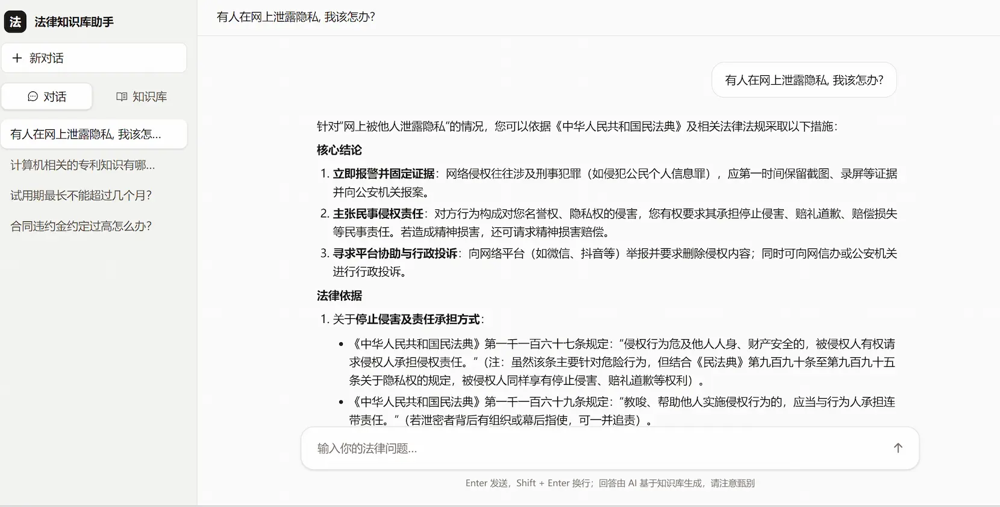
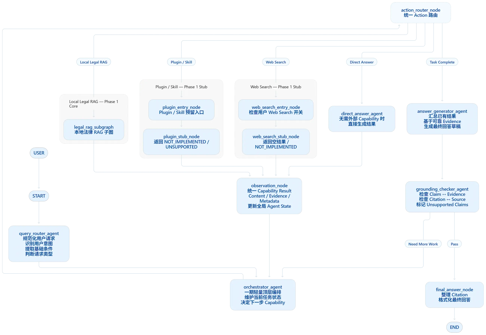
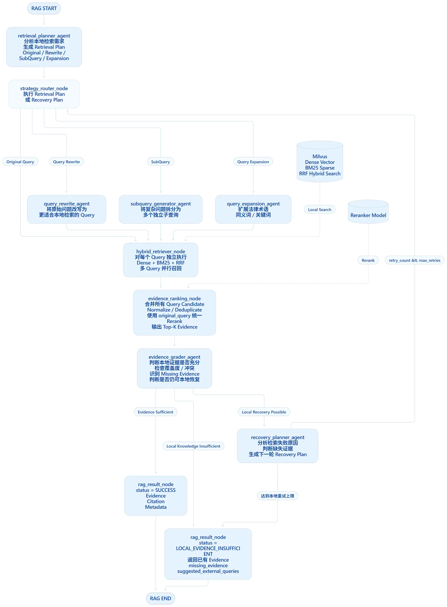

# Law Agent

> 基于 LangGraph、Milvus 和 FastAPI 构建的法律助手 Agent。


> [!IMPORTANT]
> 本项目处于工程实践阶段；模型输出仅供参考，不构成法律意见，也不能替代执业律师的专业判断。


## 项目简介

Law Agent 意图构建法律助手，已完成知识库问答场景（法条检索），并通过 Tavily Remote MCP 提供可由用户显式开启的联网搜索；合同&文书审查、案件辅助等插件仍保留 Stub 入口，等待后续开发。

用户可以上传文档，系统完成文档解析、清洗、段落感知切分、向量化和 Milvus 入库；用户提问后，Agent 通过 LangGraph 主图与 Local Legal RAG 子图完成问题路由、本地 Legal RAG、依据校验与确定性收尾；检索走 Milvus 稠密向量 + BM25 混合召回（服务端 RRF），本地 Reranker 重排。回答必须能落到知识库来源；没有依据时会明确说明，而不是编造法条。

项目的重点不是简单地把检索结果拼接到 Prompt，而是将以下能力组合成一条可观测、可测试、可降级的 Agent 链路



## 技术栈

| 层 | 选型 |
| --- | --- |
| 前端 | React 19 · TypeScript（严格模式）· Vite 8 · Tailwind CSS v4 · React Router 7 |
| 后端 | Python 3.11 · FastAPI（全异步）· uv · LangGraph |
| 数据 | SQLAlchemy 2.0 Async + SQLite（当前启用；MySQL 预留端口） |
| 检索 | Milvus Cloud（默认）或 Milvus Standalone（dense + 稀疏 BM25，服务端 `hybrid_search` + RRF） |
| 模型 | Ollama 本地、智谱 GLM API 或 DeepSeek API；Embedding 使用 llama serve Qwen3 GGUF |
| 重排 | llama serve Qwen3 Reranker GGUF；关闭或服务失败时使用 RRF 序 |
| 观测 | 结构化 JSON 日志 + 可选 Langfuse 三级 trace |


Agent 编排: LangGraph 主图 + Local Legal RAG 子图；
- 主图负责意图路由、能力编排和收尾，实现“编排决策 → 执行 → 汇总观察结果 → 再次决策”, 实现受控、结构化的 ReAct 主循环, 通过 Grounding 校验反馈加入了 Reflection/自我纠错能力
- RAG 子图SubAgent负责检索策略与证据处理, 实行Plan-and-Execute, Planner选择原始问题、查询改写、子问题拆分、术语扩展等strategy，通过条件边fan-out并发执行混合检索
- 可观测性: Langfuse trace/span/generation结构化、JSON 日志、Request ID、节点耗时、LLM generation、 三级追踪
- 工程边界: API → Application → Domain；Infrastructure 和 Agent 实现DDD领域端口，统一由依赖装配点注入


## 系统架构

```text
Frontend (React)  --HTTP/SSE-->  FastAPI
                                      │
                    Application  →  Domain 端口
                                      ▲
                    Infrastructure    │    Agent (LangGraph)
                    SQLite / Milvus   │    主图 + legal_rag 子图
                    Ollama / GLM / DeepSeek│    llama serve / Tavily MCP
```

### 主图流程



### RAG 子图流程



## 快速开始
### 环境要求
- Python `>=3.11`, 以及环境变量管理工具 [uv]
- Milvus Cloud Endpoint + API Key（默认）；或 Docker Desktop（本地 Milvus standalone）
- Node.js 与 npm
- llama serve

### 1. 克隆项目并创建配置
```bash
git clone https://github.com/mark129873/law_agent.git
cd law_agent
cp backend/.env.example backend/.env
```
### 2. 配置 Milvus

默认连接 Milvus Cloud。在 `backend/.env` 中填写：

```dotenv
MILVUS_CLOUD_URI=https://<cluster-endpoint>
MILVUS_PROVIDER=cloud
MILVUS_CLOUD_TOKEN=<zilliz-api-key>
MILVUS_COLLECTION_NAME=law_chunks
```

### 3. 配置并启动 llama serve 模型服务

在 `backend/.env` 配置Embedding以及 Reranker GGUF 路径和服务地址, 并启动：

端口约定：Ollama 对话服务保留默认的 `11434`，Embedding llama serve 使用 `11436`，Reranker 使用 `11435`，三者可以同时运行。

```dotenv
EMBEDDING_BASE_URL=http://127.0.0.1:11436
EMBEDDING_MODEL_PATH=C:\Users\<user>\Desktop\model\Qwen3-Embedding-0.6B-Q8_0.gguf
RERANKER_BASE_URL=http://127.0.0.1:11435
RERANKER_MODEL_PATH=C:\Users\<user>\Desktop\model\qwen3-reranker-0.6b-q8_0.gguf
LLAMA_DEVICE=Vulkan1
LLAMA_CONTEXT_SIZE=4096
```
```bash
cd backend
uv sync
uv run python scripts/start_llama_servers.py
```

### 4. 配置并启动后端

```bash
cd backend
uv run uvicorn app.main:app --host 0.0.0.0 --port 8000
```
当前默认使用 DeepSeek，需配置DEEPSEEK_API_KEY；并设置LLM_PROVIDER=deepseek
若使用 Ollama, 则可以拉取qwen3.5:4b，保持 `OLLAMA_BASE_URL=http://127.0.0.1:11434`，并设置 `LLM_PROVIDER=ollama`
若使用 GLM，则需配置 GLM_API_KEY，并设置 LLM_PROVIDER=glm

### 5. 启动前端
```bash
cd frontend
npm install
npm run dev
```
- 访问：<http://localhost:5173>

## 项目结构

```text
law_agent/
├── backend/
│   ├── app/
│   │   ├── api/              # FastAPI 路由、DTO、异常处理
│   │   ├── application/      # 问答、会话、文档、知识库应用服务
│   │   ├── domain/           # 实体、Repository 和领域端口
│   │   ├── infrastructure/   # SQLite、Milvus、Ollama、GLM、DeepSeek、Langfuse 实现
│   │   ├── agent/             # LangGraph 主图、RAG 子图、Prompt、Agent 服务
│   │   └── containers.py      # 唯一依赖装配点
│   ├── tests/                 # unit / integration / API 测试
│   ├── scripts/               # Milvus 重置、真实 E2E 等脚本
│   ├── docker-compose.yml     # Milvus standalone 依赖
│   └── pyproject.toml
├── frontend/
│   ├── src/api/               # 统一 API 与 SSE 客户端
│   ├── src/state/             # React Context 状态
│   ├── src/pages/             # 对话页、知识库页
│   └── src/components/        # 通用 UI 组件
├── docs/
│   ├── ARCHITECTURE.md        # 架构、数据流、契约和测试体系
│   ├── PRODUCT.md             # 用户可见行为与产品边界
│   └── RELIABILITY.md         # 日志、观测和干净环境规范
└── README.md
```

## RAG 质量评测

评测直接调用 `QaWorkflow`，根据测试问题、答案要点、检索证据和最终回答评估 RAG 生成质量。
真实质量评测固定使用以下链路：DeepSeek 主 LLM、当前配置的 Milvus、llama serve Qwen3 Reranker
和 Qwen3 Embedding。

```bash
cd backend
uv run python scripts/evaluate_rag.py workflow --cases tests/evaluation/rag_cases.jsonl
```

数据集位于 `backend/tests/evaluation/rag_cases.jsonl`，包含问题、期望来源、答案要点和引用要求。
LLM Judge 对每条回答按 0–5 分评分：

### 指标说明

确定性指标不调用模型，直接根据测试集契约、检索来源和引用计算；Judge 指标用于评价最终回答的语义质量。报告中的汇总值是所有已完成案例的平均值。

| 指标| 作用与解读 |
| --- | --- |
| Hit@K | Top K 个检索来源中是否至少出现一个期望来源；衡量“能不能找到正确来源”。 |
| Recall@K | Top K 覆盖了多少个期望来源；衡量证据覆盖是否完整，期望来源越多越重要。 |
| MRR | 第一个期望来源的倒数排名；正确来源排第 1 名为 1.0，排第 2 名为 0.5，越靠前越好。 |
| 引用精确率 | 实际引用中有多少是期望来源；衡量是否引用了无关材料。 |
| 引用召回率 | 期望来源中有多少被实际引用；衡量回答是否把应引用的来源都标出来。 |
| 状态匹配率 | 实际状态是否符合数据集预期，例如成功回答或禁用能力；衡量工作流契约和路由行为。 |
| grounding 通过率| 内置 grounding 检查是否接受回答的证据支持、引用和“证据不足”处理；衡量回答是否落在可用证据范围内。 |
| Judge 通过率 | 同时满足状态匹配和 Judge 四项门槛的比例；是语义质量的综合门槛，不替代检索指标。 |
| Judge 四项均分 | 分别衡量正确性、完整性、依据支持和引用准确性；每题 0–5 分，便于定位回答质量短板。 |
| 完成数 / 失败数 | 衡量评测链路是否稳定；失败案例没有质量分，命令成功退出也不等于质量达标。 |
| 延迟  | 衡量端到端耗时；P50 表示典型耗时，P95 反映较慢案例和尾延迟。 |

### 当前 50 条真实评测结果
| 案例数 | 50 |
| 完成数 | 50 |
| 工作流失败数 | 0 |
| 状态匹配率 | 100.0% |
| grounding 通过率 | 100.0% |
| Judge 通过率 | 100.0% |
| Hit@5 | 92.0% |
| Recall@5 | 92.0% |
| MRR | 92.0% |
| 引用精确率 | 89.5% |
| 引用召回率 | 92.0% |
| 延迟 P50/P95 | 12340 / 24763 ms |

如果当前知识库尚未导入评测文档，先执行：
```bash
cd backend
uv run python scripts/evaluate_rag.py prepare --base-url http://127.0.0.1:8000
```

`prepare` 会向当前知识库追加测试文档；只有明确需要重建当前知识库时才使用
`prepare --reset`，该参数会删除当前 SQLite 数据库中的全部文档及其向量内容，不能当作普通评测前置步骤。
结果写入 `backend/log/evaluation/<run_id>/`：`report.json` 

## 许可证

本项目采用 [MIT License](LICENSE) 开源。
