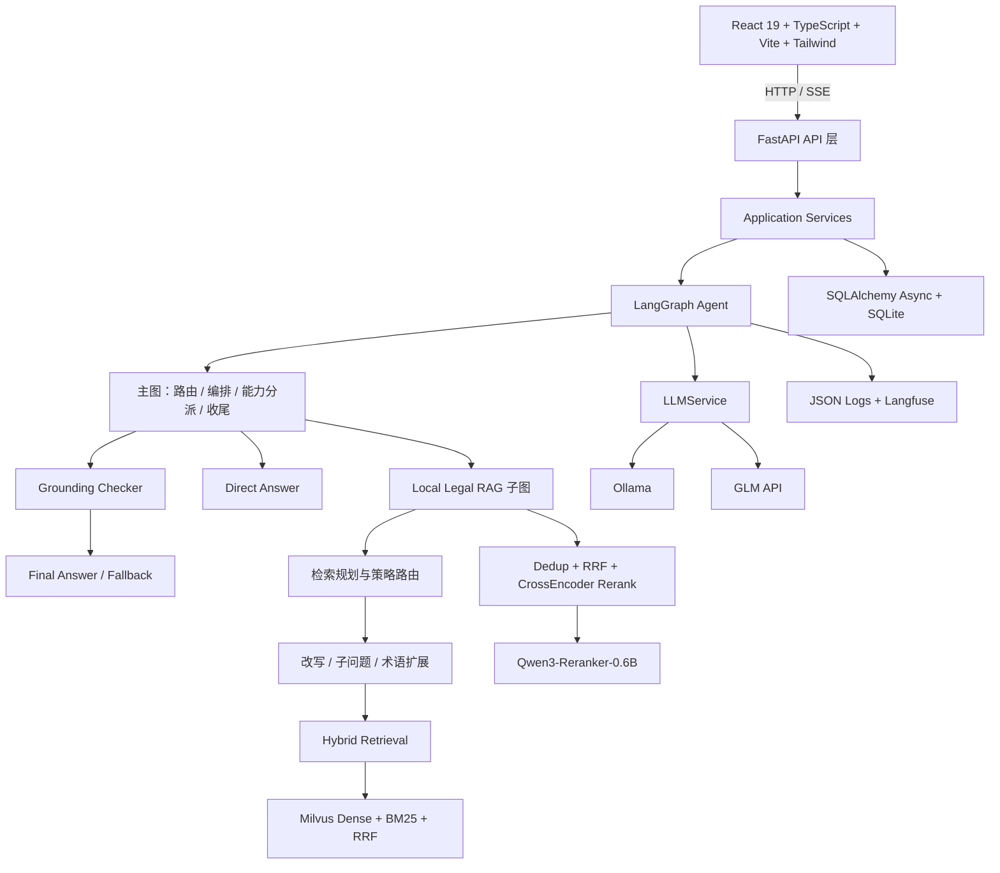
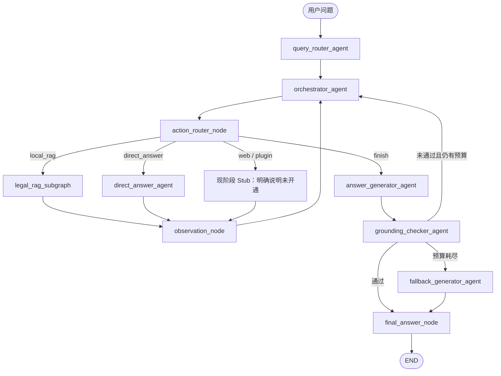

# Law Agent

> 基于 LangGraph、Milvus 和 FastAPI 构建的法律知识库问答 Agent。
>
> 支持法律文档上传、知识库检索、混合召回、证据重排、依据校验、流式回答和会话持久化，适合用于搭建可追溯的领域知识问答应用。

> [!IMPORTANT]
> 本项目处于学习与工程实践阶段，默认配置面向本地开发环境；模型输出仅供参考，不构成法律意见，也不能替代执业律师的专业判断。

## 导航

- [项目简介](#项目简介)
- [技术亮点](#技术亮点)
- [系统架构](#系统架构)
- [RAG 技术链路](#rag-技术链路)
- [快速开始](#快速开始)
- [配置说明](#配置说明)
- [API 入口](#api-入口)
- [测试与验证](#测试与验证)
- [当前边界](#当前边界)

## 项目简介

Law Agent 面向“法律文档 + 法律问题”的知识库问答场景。用户可以上传 PDF、TXT、MD 等文档，系统完成文档解析、清洗、段落感知切分、向量化和 Milvus 入库；用户提问后，Agent 通过 LangGraph 主图与 Local Legal RAG 子图完成问题路由、检索规划、证据评估、回答生成和依据校验。

项目的重点不是简单地把检索结果拼接到 Prompt，而是将以下能力组合成一条可观测、可测试、可降级的 Agent 链路：

- 基于 LangGraph 的主图编排与独立 Local Legal RAG 子图
- Milvus Dense + BM25 稀疏检索与 RRF 融合
- 原始问题、改写、子问题、术语扩展的多查询并发召回
- CrossEncoder 统一重排与 RRF 降级策略
- 证据充分性评估、有限恢复检索、Grounding 校验和谨慎兜底
- SSE 流式回答、节点状态、思考过程、检索策略和参考文档实时展示
- DDD 分层、领域端口、依赖注入、结构化日志与 Langfuse 可观测性

## 技术亮点

| 方向 | 实现要点 |
| --- | --- |
| Agent 编排 | LangGraph 主图 + Local Legal RAG 子图；主图负责意图路由、能力编排和收尾，RAG 子图负责检索策略与证据处理 |
| 检索规划 | Planner 选择原始问题、查询改写、子问题拆分、术语扩展，并通过条件边进行 fan-out |
| 混合检索 | Milvus 服务端完成 Dense Vector + BM25 + RRF 融合，业务层通过 `VectorStore` 端口访问 |
| 证据排序 | 多 Query 结果去重、RRF 预截断，再使用 Qwen3-Reranker-0.6B CrossEncoder 统一重排；模型不可用时降级为 RRF |
| 可靠回答 | Evidence Grader 判断覆盖度、缺失和可恢复性；Grounding Checker 检查来源标注和信息不足声明；失败后进入有限恢复或谨慎兜底 |
| 流式交互 | FastAPI SSE 输出 `status`、`think`、`plan`、`sources`、`delta`、`regenerating`、`done`、`error` 事件 |
| 可观测性 | 结构化 JSON 日志、Request ID、节点耗时、LLM generation、Langfuse trace/span/generation 三级追踪 |
| 工程边界 | API → Application → Domain；Infrastructure 和 Agent 实现领域端口，统一由依赖装配点注入 |

## 系统架构



### 主图流程



当前默认失败预算为：

- `LegalRAGConfig.max_retries = 1`：证据不足时最多恢复检索一轮。
- `AgentConfig.max_global_steps = 2`：主图总体预算耗尽后进入现有 fallback 路径。
- Milvus 单查询异常重试和 LLM 结构化输出解析重试保持独立，不与上述两个预算混用。

## RAG 技术链路

### 1. 文档入库

```text
上传文件
  → 格式识别与解析（PDF / TXT / MD）
  → 文本清洗
  → 段落感知切分（超长段落退化为滑动窗口）
  → Embedding
  → Milvus 向量与稀疏索引
  → 文档元数据与处理状态持久化
```

文档切分优先保持法律条文的段落完整性，避免把一条法条从中间切开，降低后续召回和回答时的上下文缺失风险。单个上传文件默认限制为 20MB。

### 2. 查询与证据处理

```text
用户问题
  → Query Router
  → Retrieval Planner
  → 原始 / 改写 / 子问题 / 术语扩展
  → 多 Query 并发 Hybrid Search
  → 去重与 RRF 融合
  → CrossEncoder 重排
  → Evidence Grader
  → Answer Generator
  → Grounding Checker
```

关键策略：

- 多查询结果统一进入同一个 Hybrid Retrieval，默认单轮查询总数不超过 8 条。
- Milvus 负责 Dense、BM25 和 RRF 融合，业务代码不直接依赖 Milvus SDK。
- 证据按 `chunk_id`、`document_id + chunk_index`、内容哈希进行多级去重。
- Reranker 统一使用原始问题作为排序查询，默认保留 Top 10 证据。
- Reranker 关闭或加载失败时自动降级为 RRF 排序，不阻断问答流程。
- 完全无命中时不伪造来源，回答明确说明知识库缺少相关依据。

## 流式事件协议

后端通过 `POST /api/chat/stream` 返回 SSE。前端可以在回答生成过程中实时展示 Agent 的执行过程：

| 事件 | 用途 |
| --- | --- |
| `status` | 节点开始、完成、耗时和状态 |
| `think` | 意图、编排、证据评估、依据校验等决策摘要 |
| `plan` | 本轮实际使用的检索查询列表 |
| `sources` | 重排后的参考文档和命中证据 |
| `delta` | 回答文本增量 |
| `regenerating` | 校验失败后开始重生成，前端清理旧回答片段 |
| `done` | 本轮回答完成 |
| `error` | 流程异常和错误信息 |

Agent 节点通过 `ContextVar` 注入事件发射器，使 Local RAG 子图中的检索策略和证据事件可以安全传递到父图的 SSE 适配器。

## 技术栈

### 后端

- Python 3.11
- FastAPI、Uvicorn、Pydantic Settings
- LangGraph
- SQLAlchemy 2.0 Async ORM、SQLite（当前启用）
- Milvus Standalone、PyMilvus
- Ollama 本地模型或 GLM API
- `sentence-transformers`、Qwen3-Reranker-0.6B、PyTorch
- HTTPX、Langfuse
- uv 依赖与虚拟环境管理

### 前端

- React 19
- TypeScript 严格模式
- Vite 8
- Tailwind CSS v4
- React Router 7
- React Markdown
- 原生 Fetch SSE 客户端

## 快速开始

### 环境要求

- Python `>=3.11,<3.12`
- [uv](https://docs.astral.sh/uv/)
- Docker Desktop / Docker Compose
- Node.js 与 npm
- Ollama，或可访问的 GLM API

### 1. 克隆项目并创建配置

```bash
git clone https://github.com/mark129873/law_agent_harness.git
cd law_agent_harness
cp backend/.env.example backend/.env
```

Windows PowerShell：

```powershell
Copy-Item backend/.env.example backend/.env
```

不要将 `backend/.env`、API Key 或 Langfuse 密钥提交到 Git。

### 2. 启动 Milvus

```bash
docker compose -f backend/docker-compose.yml up -d
```

确认 Milvus 就绪：

```bash
curl http://127.0.0.1:9091/healthz
```

Windows PowerShell 可使用 `curl.exe http://127.0.0.1:9091/healthz`，避免把 `curl` 解析为 PowerShell 别名。

返回 `OK` 后再启动后端。Milvus Compose 会启动 `etcd`、`minio` 和 `milvus-standalone` 三个容器。

### 3. 配置并启动后端

```bash
cd backend
uv sync
uv run uvicorn app.main:app --host 0.0.0.0 --port 8000
```

默认配置使用 Ollama：

```bash
ollama serve
ollama pull qwen3.5:4b
ollama pull nomic-embed-text:latest
```

如果使用 GLM，将 `backend/.env` 中的 `LLM_PROVIDER` 改为 `glm`，并设置 `GLM_API_KEY`。当前 Embedding 默认仍由 Ollama 提供，因此使用 GLM 对话模型时也需要准备 Embedding 服务。

### 4. 启动前端

另开终端：

```bash
cd frontend
npm install
npm run dev
```

访问：

- 前端：<http://localhost:5173>
- 后端健康检查：<http://localhost:8000/api/health>
- FastAPI 文档：<http://localhost:8000/docs>

## 配置说明

完整模板见 [`backend/.env.example`](backend/.env.example)。常用配置如下：

| 配置项 | 默认值 | 说明 |
| --- | --- | --- |
| `DB_PROVIDER` | `sqlite` | 当前启用 SQLite；数据库访问已通过端口和 SQLAlchemy 抽象 |
| `VECTOR_STORE_PROVIDER` | `milvus` | 当前使用 Milvus Standalone |
| `MILVUS_URI` | `http://127.0.0.1:19530` | Milvus 连接地址 |
| `LLM_PROVIDER` | `ollama` | `ollama` 或 `glm` |
| `PLANNER_PROVIDER` | `follow` | 规划模型默认跟随主模型，也可单独选择 `ollama` 或 `glm` |
| `OLLAMA_MODEL` | `qwen3.5:4b` | Ollama 对话模型 |
| `OLLAMA_EMBEDDING_MODEL` | `nomic-embed-text:latest` | Embedding 模型 |
| `RERANK_ENABLED` | `true` | CPU 环境建议关闭，关闭后使用 RRF 降级排序 |
| `RERANKER_DEVICE` | `cpu` | 可配置为 `cuda` |
| `LANGFUSE_ENABLED` | `false` | 是否启用 Langfuse trace；关闭时不影响业务 |
| `LOG_LEVEL` | `INFO` | `DEBUG`、`INFO`、`WARN` 或 `ERROR` |

CPU 环境下，Qwen3-Reranker-0.6B 可能明显增加响应时间；可以设置：

```env
RERANK_ENABLED=false
```

此时系统仍会保留 RRF 排序结果和 `degraded` 观测信息。

## API 入口

| 方法 | 路径 | 作用 |
| --- | --- | --- |
| `GET` | `/api/health` | 服务健康检查 |
| `POST` | `/api/documents` | 上传 PDF / TXT / MD 文档 |
| `GET` | `/api/documents` | 查询知识库文档和处理状态 |
| `DELETE` | `/api/documents/{document_id}` | 删除文档及其知识库内容 |
| `POST` | `/api/conversations` | 创建会话 |
| `GET` | `/api/conversations` | 查询会话列表 |
| `GET` | `/api/conversations/{conversation_id}/messages` | 查询会话消息 |
| `DELETE` | `/api/conversations/{conversation_id}` | 删除会话 |
| `POST` | `/api/chat/stream` | SSE 流式问答 |

## 项目结构

```text
law_agent/
├── backend/
│   ├── app/
│   │   ├── api/              # FastAPI 路由、DTO、异常处理
│   │   ├── application/      # 问答、会话、文档、知识库应用服务
│   │   ├── domain/           # 实体、Repository 和领域端口
│   │   ├── infrastructure/   # SQLite、Milvus、Ollama、GLM、Langfuse 实现
│   │   ├── agent/             # LangGraph 主图、RAG 子图、Prompt、Agent 服务
│   │   └── containers.py      # 唯一依赖装配点
│   ├── tests/                 # unit / integration / API 测试
│   ├── scripts/               # Milvus 重置、真实 E2E 等脚本
│   ├── docker-compose.yml     # Milvus standalone 依赖
│   └── pyproject.toml
├── frontend/
│   ├── src/api/               # 统一 API 与 SSE 客户端
│   ├── src/state/             # React Context 状态
│   ├── src/pages/             # 对话页、知识库页
│   └── src/components/        # 通用 UI 组件
├── docs/
│   ├── ARCHITECTURE.md        # 架构、数据流、契约和测试体系
│   ├── PRODUCT.md             # 用户可见行为与产品边界
│   └── RELIABILITY.md         # 日志、观测和干净环境规范
└── README.md
```

## 测试与验证

后端全量测试：

```bash
cd backend
uv run pytest tests -q -rs
```

前端类型检查与生产构建：

```bash
cd frontend
npm run build
```

项目测试分为：

- Unit：纯函数、Agent 节点、领域端口和边界约束测试
- Integration：主图、Local Legal RAG 子图、API 和持久化流程测试
- Fake Provider：使用领域端口替换真实 LLM、Embedding、VectorStore 和 Reranker
- Real Milvus：需要 Milvus 容器；服务不可达时相关测试自动跳过
- Real E2E：`backend/scripts/verify_real_e2e.py`，用于联调模型、Milvus、SSE 和持久化结果

截至 2026-09-13，当前本地验证基线为后端 `225 passed`，前端 `npm run build` 通过。测试数量会随功能演进变化，请以本地最新执行结果为准。

## 当前边界

- Web Search 和 Plugin 当前保留稳定入口与 Stub，不会编造外部搜索或插件结果。
- 数据库当前默认使用 SQLite；SQLAlchemy 和 Repository 端口已为后续 MySQL 8.0 切换保留边界。
- Reranker 在 CPU 环境可能带来较高延迟，建议先关闭 `RERANK_ENABLED` 验证主流程。
- Langfuse 是可选观测能力，服务不可达不应阻断问答流程。
- 生产环境仍需补充身份认证、权限控制、限流、敏感信息治理和正式的开源许可证声明。

## 相关文档

- [架构与数据流](docs/ARCHITECTURE.md)
- [产品行为与交互](docs/PRODUCT.md)
- [可靠性、日志与可观测性](docs/RELIABILITY.md)
- [初始化与启动检查](init.md)

## 参与贡献

欢迎通过 Issue 反馈可复现的问题，也欢迎提交 Pull Request。提交前请确保：

- 后端测试与前端生产构建通过；
- 没有提交 `.env`、API Key、日志、数据库文件、模型文件或其他敏感数据；
- 功能行为、架构说明与测试证据保持同步；
- 涉及法律回答策略的修改明确说明适用边界和降级行为。

## License

当前仓库尚未附带正式 `LICENSE` 文件。公开发布或允许第三方使用前，请根据项目实际授权方式补充许可证声明。
