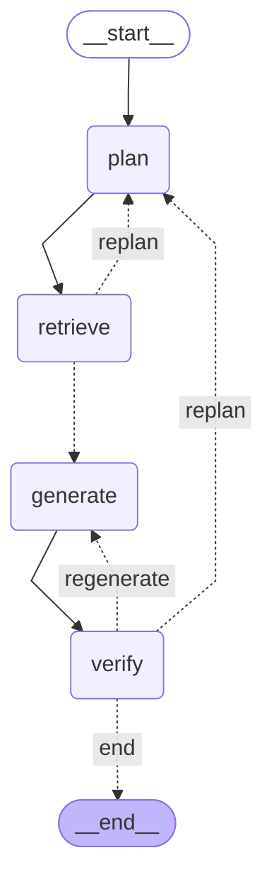

# Architecture

## 0. 简单描述
-本文档只描述**架构与实现**（分层、数据流、配置、契约、测试体系）；用户可见的行为需求见 docs/PRODUCT.md
-实现变更不得改变 PRODUCT.md 描述的用户可见行为；行为要变，先改 PRODUCT.md，再改实现
-后端使用python3.11.15, 使用uv进行环境管理,.venv是虚拟环境
-后端使用fastapi, 接口使用异步函数
-后端使用langraph, 大模型支持ollama本地部署以及使用glm的api, 
-数据库此版本支持sqlite3, 后续版本支持mysql8.0根据配置进行切换, 做好数据库接口层抽象
-数据库实现统一走 SQLAlchemy 2.0 async ORM（声明式模型 + Data Mapper 映射），SQLite 是当前唯一已启用的 Provider，MySQL 8.0 接入只需换 URL 与异步驱动
-向量数据库使用 Milvus（standalone 部署，backend/docker-compose.yml 编排 etcd + minio + milvus），稠密向量与稀疏 BM25 混合检索由 Milvus 服务端 hybrid_search 完成（BE-029），业务代码经 VectorStore 端口访问，不感知具体实现

## 1. 系统概览

法律知识库与法律问答 Agent，前后端分离：

```text
┌─────────────────────────────────────────────────────────────┐
│                         Frontend                            │
│        React + TypeScript + Vite + Tailwind CSS            │
│              Chat / 会话管理 / 知识库管理（待开发）           │
└───────────────────────────┬─────────────────────────────────┘
                            │ HTTP / SSE
                            ▼
┌─────────────────────────────────────────────────────────────┐
│                Backend（DDD 分层 + 依赖注入）                 │
│  API 层 ──▶ Application 层 ──▶ Domain 层（实体 + 端口）      │
│                    ▲                     ▲                  │
│                    └── Infrastructure 层实现领域端口          │
│  Agent 模块（LangGraph，实现 QaWorkflow 端口）                │
└──────────────┬──────────────────┬───────────────────────────┘
               ▼                  ▼
      ┌────────────────┐  ┌────────────────┐
      │ SQLite → MySQL │  │ Milvus（dense+sparse）│
      └────────────────┘  └────────────────┘
               │
               ▼
      ┌─────────────────────────────┐
      │ LLM：Ollama 本地 / GLM API  │
      └─────────────────────────────┘
```

技术栈：Python 3.11 + FastAPI（全异步）+ uv 环境管理 + LangGraph + SQLAlchemy 2.0 async ORM（声明式模型 + AsyncSession，当前挂 aiosqlite 驱动）+ Milvus（服务端 hybrid_search：稠密 + 稀疏 BM25，RRF 融合）+ httpx。
前端技术栈：React 19 + TypeScript（严格模式）+ Vite 8 + Tailwind CSS v4 + React Router 7 + 原生 Fetch（无 axios）。

## 2. 目录结构

```text
backend/
├── app/
│   ├── api/                    # API / Controller 层
│   │   ├── dto.py              # 请求/响应模型（pydantic）
│   │   ├── errors.py           # 统一 AppError 体系与全局异常处理器
│   │   ├── middleware.py       # RequestIdMiddleware（纯 ASGI，注入请求链路标识）
│   │   └── routes/             # conversations / chat / documents 路由
│   │
│   ├── application/            # Application 层：业务流程编排
│   │   └── services/
│   │       ├── chat_service.py          # 问答编排（会话持久化 + QaWorkflow 端口）
│   │       ├── conversation_service.py  # 会话生命周期与消息持久化
│   │       ├── document_pipeline.py     # 解析→清洗→段落感知切分（解析器工厂）
│   │       ├── document_service.py      # 文档元数据状态机 + 入库/删除
│   │       ├── knowledge_service.py     # Pipeline→Embedding→向量库+关键词索引 双写入库
│   │       └── rag_service.py           # 混合检索编排（服务端 RRF 融合）与上下文构建
│   │
│   ├── domain/                 # Domain 层：实体 + 端口（零技术依赖）
│   │   ├── entities/           # conversation / message / document / chunk / llm
│   │   ├── repositories/       # Database / Conversation / Message / Document / VectorStore / LLMProvider 端口
│   │   └── services/           # document_parser / embedding / qa_workflow 端口
│   │
│   ├── infrastructure/         # 基础设施实现（实现领域端口）
│   │   ├── database/sqlalchemy/ # SQLAlchemyDatabase（models.py 声明式 ORM 模型 / mappers.py 实体↔模型映射 / types.py 时区无损时间列 / database.py 端口实现）；方言无关，MySQL 预留靠 URL 切换
│   │   ├── vector_store/       # MilvusVectorStore（dense+sparse 单集合，服务端 hybrid_search）
│   │   ├── llm/                # OllamaProvider / GLMProvider
│   │   ├── document_parser/    # PdfParser（pypdf）/ TextParser（txt/md，多编码回退）
│   │   └── embedding/          # OllamaEmbeddingService（/api/embed 批量）
│   │
│   ├── agent/                  # LangGraph Agent（※ 全项目唯一允许导入 langgraph 的业务模块）
│   │   ├── __init__.py         # 对外唯一入口：create_qa_workflow 工厂
│   │   ├── graph.py            # QaGraphBuilder 建造者 + LangGraphQaWorkflow 适配器
│   │   ├── nodes.py            # AgentNode 抽象基类 + Retrieve/Generate 节点（命令模式）
│   │   ├── prompts.py          # 法律问答策略 Prompt
│   │   └── state.py            # AgentState
│   │
│   ├── common/                 # 横切基础设施：di.py 轻量容器 / logging.py 结构化 JSON 日志（stdout + backend/log 落盘）
│   ├── config/settings.py      # 统一配置（pydantic-settings，相对路径锚定 backend/）
│   ├── containers.py           # 唯一依赖装配点（工厂 + 单例注册）
│   └── main.py                 # 应用入口（lifespan / CORS / 路由 / 异常处理）
│
├── tests/
│   ├── unit/                   # 单元测试：纯逻辑与抽象层，无外部 IO
│   ├── integration/            # 集成测试：真实 SQLite/Milvus（服务不可达时跳过）/MockTransport/完整应用
│   └── data_source/            # RAG 测试数据源（真实法律文档）
├── log/                        # 运行日志（app.log + 按天轮转，gitignore，启动自动创建）
├── scripts/                    # 手工验证脚本（Ollama 流式 / 真实 embedding / E2E）
├── pyproject.toml / uv.lock
└── .env                        # 本地敏感配置（gitignore，模板见 .env.example）
```

```text
frontend/                        # 前端独立项目（React + TS + Vite）
├── index.html                   # 唯一 HTML 入口（React 挂载点 #root）
├── vite.config.ts               # React/Tailwind v4 插件；dev 期 /api 代理到 127.0.0.1:8000
├── tsconfig.json                # TS 严格模式；build 前先 tsc --noEmit 类型检查
├── package.json                 # npm 依赖与脚本（dev / build / preview）
└── src/
    ├── main.tsx                 # 应用入口：BrowserRouter（路由）> AppProvider（状态）> App
    ├── App.tsx                  # 路由表（URL → 页面组件），集中一处便于总览
    ├── index.css                # Tailwind v4 入口 + 语义化主题 token（明暗双主题跟随系统）
    ├── vite-env.d.ts            # Vite 内置 API 与样式导入的类型声明
    ├── types/index.ts           # 与后端契约一一对应的类型（会话/消息/文档/错误/SSE 事件）
    ├── api/                     # 统一数据访问层（FE-002）：UI 组件禁止直接 fetch
    │   ├── client.ts            # request<T> 封装 + ApiError（解析统一错误结构 {code,message}）
    │   ├── health.ts            # 健康检查（连接状态指示）
    │   ├── conversations.ts     # 会话列表/创建/消息/删除
    │   ├── documents.ts         # 文档列表/上传(multipart)/删除 + 白名单与大小上限常量
    │   └── chat.ts              # 流式问答：fetch 消费 SSE，拆分 delta/done/error 事件
    ├── state/AppContext.tsx     # 轻量全局状态（React Context）：会话/消息/文档/视图与业务动作
    ├── pages/                   # 页面组件（对话页 / 知识库页）
    ├── components/              # 通用组件（侧边栏、消息块、上传面板等）
    └── utils/format.ts          # 纯函数工具（文件大小/日期格式化）
```

### 前端数据流
前端数据流要点：提问经 `AppContext.sendQuestion`（无会话先建会话，title=提问截短 20 字）乐观插入消息后由 `api/chat.ts` 消费 SSE 增量写回；助手消息经 react-markdown 渲染（不解析原始 HTML，无 XSS），流式中未闭合标记短暂显示为字面字符；带 `sources` 的消息（含历史恢复）渲染「参考文档」折叠列表，来源内容按纯文本渲染；图标统一 `@phosphor-icons/react`，不引第二套图标族

## 3. 分层架构与领域端口

### 依赖原则与合规守护
- 依赖方向：API → Application → Domain；Infrastructure / Agent 实现领域端口；具体实现由 `containers.py` 按配置注入（工厂模式 + 双重检查锁单例）。
- 隔离区：langgraph 只允许 `app/agent/` 导入（外部一律经 `create_qa_workflow` 工厂）；sqlalchemy 只允许 `app/infrastructure/database/` 导入；应用层与 API 层禁止导入 `app.infrastructure`；领域层禁止导入任何技术库；抽象只允许定义在 domain 层（新增端口同步更新下表）。
- 以上由 `tests/unit/test_ddd_boundaries.py` 以 AST 扫描在每次 pytest 机械校验（曾据此发现 Database 端口错位、chat_service 依赖 langgraph 类型等违例）。

### 领域端口清单
| 端口 | 定义位置 | 当前实现 |
|------|---------|---------|
| `Database` / `TransactionContext` | domain/repositories/database.py | SQLAlchemyDatabase（方言无关，MySQL 靠 URL 切换） |
| `ConversationRepository` / `MessageRepository` / `DocumentRepository` | domain/repositories/ | SQLAlchemyDatabase 内置仓库（ORM Session + Data Mapper） |
| `VectorStore` | domain/repositories/vector_store.py | MilvusVectorStore（dense+sparse 单集合，服务端 hybrid_search） |
| `LLMProvider` | domain/repositories/llm_provider.py | OllamaProvider / GLMProvider |
| `DocumentParser` | domain/services/document_parser.py | TextParser（txt/md 多编码回退）/ PdfParser（pypdf） |
| `EmbeddingService` | domain/services/embedding.py | OllamaEmbeddingService（/api/embed 批量） |
| `QaWorkflow` | domain/services/qa_workflow.py | LangGraph 工作流（agent/，`create_qa_workflow` 工厂） |

### ORM 使用约定（BE-025，精要）
- **两套模型、一层映射（Data Mapper）**：ORM 模型（models.py）只属于 infrastructure，领域实体保持纯 dataclass，`mappers.py` 显式双向映射；仓储出口只返回领域实体，ORM 模型不得越过 infrastructure 边界（测试锁定）。
- **Session**：`async_sessionmaker(expire_on_commit=False)` + 单个 `AsyncSession`（进程级单连接）——默认 True 时 commit 后访问属性会触发同步刷新，asyncio 下抛 `MissingGreenlet`。
- **不定义 relationship**：消息按 `conversation_id` 显式查询，级联删除靠表级 `ON DELETE CASCADE`；用不到的关系图能力不引入（无异步懒加载风险）。
- **更新/删除语义**：文档状态更新用"取出模型→改属性"（保持 identity map 一致）；批量删除用 `delete()` + `synchronize_session="fetch"`（要影响行数、防脏读）；JSON 沿用 TEXT + `json.dumps(ensure_ascii=False)`。

### 排序职责（BE-024）
仓储不排序（不用 SQLite 专有 `rowid`）；三处列表顺序由应用服务层按 `created_at` 实现：会话、消息正序，文档倒序——换数据库排序行为不变。同一 `created_at` 靠 Python `sorted` 稳定性保证结果一致，不引入物理行号兜底键。

## 4. 核心数据流

### RAG 问答全链路（流式）
```text
POST /api/chat/stream {conversation_id, question}
  ▼ ChatService：历史快照 → 保存用户消息 → QaWorkflow 端口 astream（图执行见 §5）
  ▼ 节点经 get_stream_writer 推领域事件（QaStreamEvent）→ SSE：plan / sources / delta* / regenerating / done | error
  ▼ 流正常结束：完整回答与参考来源一起持久化为 assistant 消息（异常中断不落库）
```
- **所有 LLM 问答必须走图**：唯一问答入口是 SSE 流式接口；检索、Prompt 组装、模型调用只有一份实现，禁止图外直连 LLMProvider 问答。图引擎的 `ainvoke`（测试/脚本经 `run_qa`）与流式共用同一节点实例。
- ChatService 只依赖 `QaWorkflow` 端口，负责会话持久化，不直接依赖 RAG/LLM。

### 文档入库全链路
```text
POST /api/documents (multipart)：白名单（40001）/ 20MB 上限（41301）→ 元数据(processing)
  ▼ DocumentPipeline：格式识别 → 解析 → 清洗 → 段落感知切分 → 批量 embedding → VectorStore.add_chunks
  ▼ 状态机：processing → ready（chunk 为空或异常 → failed，不产生僵尸记录）
DELETE /api/documents/{id}：向量按 document_id 删除 + 元数据删除（必须同时清理）
```
- 段落感知切分（`chunk_size` 500 / `chunk_overlap` 50）：优先按换行段落打包，保证一条法规完整入同一 chunk——定长切分会把长条文截断到两个 chunk，检索命中也答不全。
- 稠密向量由 EmbeddingService 传入，稀疏 BM25 由 Milvus 服务端按 content 字段自动生成（BM25 Function），两路同源、无双写一致性问题。

### RAG 混合检索（BE-029，Milvus 服务端 hybrid_search）
`VectorStore.hybrid_search` 一次调用同时发起两路：稠密（FLOAT_VECTOR/COSINE，min_score 经 range search 只过滤稠密通道）+ 稀疏（SPARSE_FLOAT_VECTOR，服务端 jieba 分词 BM25 打分）→ Milvus 服务端 `RRFRanker(k=60)` 融合直接返回 top_k。
- **为什么混合/服务端融合**：向量检索擅长语义相似，法条编号等精确词面靠 BM25 补足；BM25 分数与余弦量纲不同不可加权，RRF 只用排名无需调权（k=60 论文推荐值）。自研 BM25（BE-028，已废弃）每次增删全量重建索引，万级 chunk 以上不可持续。
- `build_context` 仍产出带【来源：文件名】的上下文，无命中返回空串，衔接"信息不足"策略；sources 事件与 Prompt 上下文同源。
- 集合懒建（首次 `add_chunks` 按实际 embedding 维度创建）；集合不存在时检索返回空 = 空知识库语义。
- Milvus 数据由容器卷持久化，不在 `backend/data/`——干净环境重置除删 data 外还需运行 `scripts/reset_milvus.py`（见 RELIABILITY.md）。

## 5. Agent 工作流（LangGraph）

### 面向对象结构
- `AgentNode`（抽象基类）+ `PlanNode` / `RetrieveNode` / `GenerateNode` / `VerifyNode`（命令模式）：`__call__` 使节点实例直接注册进图，新增节点继承基类即可。
- `QaGraphBuilder`（建造者）：统一装配 Plan-and-Execute 闭环（rag 必选——知识库检索是问答固有环节，"无知识库"由空命中路径承接），装配与条件边规则集中一处。
- `LangGraphQaWorkflow`（适配器）显式实现 `QaWorkflow` 领域端口，langgraph 引擎封在适配器之内；对外唯一入口 `create_qa_workflow(llm, rag, planner=None)` 工厂（planner 缺省跟随主 LLM，BE-030）。
- 所有问题统一进规划闭环：简单问题 = 规划器输出单子查询透传原问题的退化情形，不做问题分类路由。

### 图拓扑（BE-030；由 scripts/export_qa_graph.py 生成，拓扑变更后重跑即可同步）



条件边分支语义：`retrieve` 空命中且 `plan_runs` 未用尽 → `replan`（回 plan 改写子查询），否则默认进 `generate`；`verify` 按 `verify_verdict` 三态路由——`grounding`（依据不足）→ `replan`、`contract`（表达契约失败）→ `regenerate`、`pass`（或预算用尽降级放行）→ `end`。

- **预算防死循环**：`plan_runs ≤ 2`、`generate_runs ≤ 2`，超限输出当前答案并记 WARN。verify 打回分两路的原因：依据不足是"检索缺口"，重规划补检索比重写有效；表达契约失败是"生成缺口"，带反馈（verify_feedback）重生成更便宜。
- **LangGraph 陷阱（踩坑记录）**：同一节点的静态出边与条件边不能并存——replan 路径下 generate 会在同一超级步并发执行并写同一 state 键，触发 `InvalidUpdateError`；故 retrieve 出边只保留条件边。
- **verify 两档**：规则档（引用来源存在性 / BE-017 信息不足声明 / 退化检查）零成本先行；judge 档 LLM groundedness 判分，解析失败视为 pass（记 WARN）——判分是增强而非闸门。
- 节点行为：plan 产出 `sub_queries` 并推 plan 事件（前端据此展示问题拆解，重规划时也推）；retrieve 逐子查询混合检索按 chunk 合并去重，有命中推 sources 事件（契约：先于当轮全部 delta，重规划后以最新一批为准）；generate 组装 Prompt 流式生成逐 token 推 delta；verify 校验打回前推 regenerating 事件。

### 法律问答策略（agent/prompts.py，BE-017）
优先依据知识库上下文回答并注明来源文件；依据为空或不足时明确告知"知识库中暂无相关依据，建议咨询专业律师"；严禁虚构法律条文、案例编号或结论，先给结论再给依据。

## 6. 配置管理

所有配置经 `config/settings.py`（pydantic-settings）读取环境变量或 `backend/.env`（模板 `.env.example`）；业务代码经 `get_settings()` 获取，禁止散读环境变量。

| 配置项 | 取值 | 默认 |
|-------|------|------|
| `DB_PROVIDER` | sqlite / mysql | sqlite |
| `VECTOR_STORE_PROVIDER` | milvus（当前唯一已启用 Provider） | milvus |
| `LLM_PROVIDER` | ollama / glm | ollama |
| `PLANNER_PROVIDER` | follow / ollama / glm | follow（跟随 LLM_PROVIDER，BE-030） |
| `PLANNER_MODEL` | 模型名 | 空（用所选 Provider 的默认模型） |
| `LLM_ENABLE_THINKING` | true / false | false |
| `MILVUS_URI` | — | http://127.0.0.1:19530 |
| `HOST` / `PORT` / `LOG_LEVEL` | — | 0.0.0.0 / 8000 / INFO |

- **思考模式开关**：qwen3.5 / glm-4.5 等推理模型默认先"思考"再回答，首字延迟曾达 30~40s；关闭时 Ollama 带 `think: false`、GLM 带 `thinking: {"type": "disabled"}`。
- **敏感配置**：`GLM_API_KEY` 等密钥只经环境变量或本地 `.env` 注入，禁止提交仓库、禁止写入日志；glm 缺密钥时装配即报错（尽早失败）。
- **路径锚定与自愈**：相对路径统一锚定 `backend/`；`backend/data/` 不存在时建连接前自动创建父目录（BE-026），清空后可直接启动。
- **切换 Provider**：仅改配置，业务代码零修改。

## 7. API 契约

所有端点异步；统一错误结构 `{"code": <int>, "message": <str>}`（40001 格式不支持 / 40002 参数非法 / 40401 会话不存在 / 40402 文档不存在 / 41301 超限 / 50000 兜底）。OpenAPI：`http://127.0.0.1:8000/docs`；CORS 当前 `allow_origins=["*"]`（开发态，生产需收敛）。

| 方法 | 路径 | 说明 |
|------|------|------|
| POST / GET | /api/conversations | 创建对话（title 可选）/ 对话列表（创建时间正序） |
| GET / DELETE | /api/conversations/{id}(/messages) | 会话消息 / 删除会话（级联消息） |
| POST | /api/chat/stream | 提交问题，SSE 流式回答 |
| POST / GET / DELETE | /api/documents({id}) | 上传 PDF/TXT/MD（multipart）/ 列表 / 删除（级联向量） |
| GET | /api/health | 健康检查 |

Chat 流式协议（SSE，`data: {json}\n\n`）：
```json
{"type": "plan", "sub_queries": ["子问题1", "子问题2"]}
{"type": "sources", "sources": [{"source": "文件名", "content": "命中内容"}]}
{"type": "delta", "content": "增量文本"}
{"type": "regenerating"}
{"type": "done", "conversation_id": "..."}
{"type": "error", "message": "..."}
```
- 事件顺序（BE-030）：`plan`（每次规划推一次，重规划时再次出现）→ `sources`（每轮检索有命中时一次，重规划后以最新一批为准）→ `delta`（每轮生成一批）→（verify 打回时 `regenerating` 后重复 sources→delta）→ `done`/`error`。字段只增不改，向后兼容（旧前端静默忽略新事件）。
- `regenerating`：前端须清空已渲染增量（否则两版回答拼接）；`done` 后回答与 sources 已持久化，`GET .../messages` 原样返回（旧库自动 ALTER 迁移），历史消息同样可展示参考文档。

## 8. 启动与验证

```bash
cd backend
docker compose up -d                               # Milvus standalone（etcd + minio + milvus，BE-029 前置）
uv sync                                            # 创建/同步 .venv（Python 3.11）
uv run uvicorn app.main:app --host 0.0.0.0 --port 8000
uv run pytest                                      # 全量测试（含 DDD 边界守护）
curl http://127.0.0.1:8000/api/health              # {"status":"ok"}

cd frontend
npm install && npm run dev                         # http://localhost:5173（/api 代理到 8000）
npm run build                                      # tsc 类型检查 + 生产构建
```
- 启动时 lifespan 自动：SQLite connect + init_schema（幂等建表）、Milvus connect（集合不存在时首次入库懒建）；均为幂等操作，重复启动安全（BE-026 首次启动自愈）。
- 日志：单行 JSON（timestamp/level/service/request_id/message/data），stdout + `backend/log/app.log`（按天轮转保留 30 天），每响应带 `x-request-id`；详见 docs/RELIABILITY.md。

## 9. 测试体系（四层）

| 层级 | 位置 | 数量 | 验证内容 |
|------|------|------|---------|
| 单元 | tests/unit/ | 62 | DI 容器、配置、DDD 边界守护（AST）、日志契约（BE-027）、规划/判分解析容错（BE-030）、回答策略、端口契约（内存 Fake）、文档 Pipeline 与解析器 |
| 集成 | tests/integration/（除 API） | 68 | 真实 SQLite（持久化/级联/事务/迁移/ORM 契约/排序契约）、首次启动自愈（BE-026）、真实 Milvus 混合检索（不可达时跳过，BE-029）、LLM/Embedding/RAG、Agent 统一规划闭环（BE-030） |
| 接口 | tests/integration/test_api.py | 9 | 完整应用（临时 SQLite + Fake 向量库/LLM）：会话 CRUD、统一错误、SSE 协议（plan 先行）、文档上传删除、x-request-id |
| 端到端 | scripts/（手工运行） | 3 脚本 | 真实 uvicorn + 真实 Milvus/LLM：上传→入库→流式 RAG 问答引用原文→持久化 |

- 自动化合计 139 个，`uv run pytest` 全量运行无需外部服务（Fake 遵循领域端口，与生产实现互换验证同一契约）；唯一例外 test_milvus_vector_store.py 需真实 Milvus，不可达时自动跳过。
- E2E 脚本依赖真实服务，不纳入 pytest（保持自动化封闭性）；结论记录于 feature_list.json 各功能 evidence。测试数据源：tests/data_source/（专利法 TXT + MD）。

## 10. 扩展点与预留

- **MySQL 8.0**：ORM 已统一表结构与 DML，接入只剩安装 `aiomysql` 驱动 + `containers.py` 加 `mysql+aiomysql://…` URL 分支并启用 `DbProvider.MYSQL`；需补真实实例集成验证与迁移方案（Alembic autogenerate 可直接消费现有声明式模型）。
- **Milvus**：容器内存上限（backend/docker-compose.yml）milvus 2GB / etcd 256MB / minio 256MB（合计 2.5GB ≈ 4GB WSL2 的 62%，防无界增长拖垮宿主机）；`MILVUS_URI` 默认 http://127.0.0.1:19530。
- **新文档格式**：实现 `DocumentParser` 策略并注册进工厂；**新 LLM Provider**：实现 `LLMProvider`（chat + stream + model_name）+ 容器加分支，密钥仅环境注入；**新问答节点**：继承 `AgentNode`，在 `QaGraphBuilder.build()` 接线。
- **前端**：遵循 §7 API 契约与 SSE 协议；开发期统一请求相对路径 `/api/...` 由 Vite 代理，前端代码不感知后端地址。
