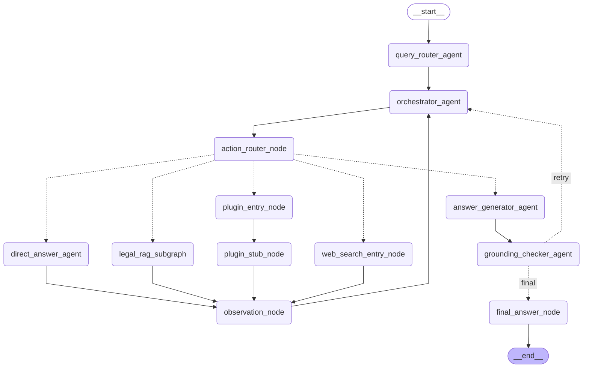

# Architecture

## 0. 简单描述
-本文档只描述**架构与实现**（分层、数据流、配置、契约、测试体系）；用户可见的行为需求见 docs/PRODUCT.md
-实现变更不得改变 PRODUCT.md 描述的用户可见行为；行为要变，先改 PRODUCT.md，再改实现
-后端 Python 3.11（uv 管理环境，.venv 虚拟环境）+ FastAPI（接口全异步）+ LangGraph，LLM 支持 Ollama 本地部署、GLM API 与 DeepSeek API（详细技术栈见 §1 末尾）
-Agent 模块一期重写（2026-09）：主图轻量编排 + 独立 Local Legal RAG 子图 + Tavily Remote MCP Web Search / Plugin Stub 入口，设计依据一期技术稿核心内容已并入本文档 §12（30 条强制约束 + 设计 §号速查）；统一重排采用 `cross-encoder/ms-marco-MiniLM-L-6-v2`（CrossEncoder，模型失败时降级 RRF；显式关闭时按配置正常使用 RRF）
-数据库此版本支持sqlite3, 后续版本支持mysql8.0根据配置进行切换, 做好数据库接口层抽象
-数据库实现统一走 SQLAlchemy 2.0 async ORM（声明式模型 + Data Mapper 映射），SQLite 是当前唯一已启用的 Provider，MySQL 8.0 接入只需换 URL 与异步驱动
-向量数据库使用 Milvus（默认连接 Milvus Cloud，也支持通过配置连接 standalone），稠密向量与稀疏 BM25 混合检索由 Milvus 服务端 hybrid_search 完成（BE-029），业务代码经 VectorStore 端口访问，不感知具体实现

## 1. 系统概览

法律知识库与法律问答 Agent，前后端分离：

```text
┌─────────────────────────────────────────────────────────────┐
│                         Frontend                            │
│        React + TypeScript + Vite + Tailwind CSS            │
│     Chat / 会话管理 / 知识库管理 / 检索策略与过程展示          │
└───────────────────────────┬─────────────────────────────────┘
                            │ HTTP / SSE
                            ▼
┌─────────────────────────────────────────────────────────────┐
│                Backend（DDD 分层 + 依赖注入）                 │
│  API 层 ──▶ Application 层 ──▶ Domain 层（实体 + 端口）      │
│                    ▲                     ▲                  │
│                    └── Infrastructure 层实现领域端口          │
│  Agent 模块（LangGraph 主图 + legal_rag 子图，实现 QaWorkflow）│
└──────────────┬──────────────────┬───────────────────────────┘
               ▼                  ▼
      ┌────────────────┐  ┌────────────────┐
      │ SQLite → MySQL │  │ Milvus（dense+sparse）│
      └────────────────┘  └────────────────┘
               │
               ▼
      ┌──────────────────────────────────┐
      │ LLM：Ollama / GLM API / DeepSeek  │
      │ Rerank：本地 MiniLM CrossEncoder   │
      └──────────────────────────────────┘
```

技术栈：Python 3.11 + FastAPI（全异步）+ uv 环境管理 + LangGraph + SQLAlchemy 2.0 async ORM（声明式模型 + AsyncSession，当前挂 aiosqlite 驱动）+ Milvus（服务端 hybrid_search：稠密 + 稀疏 BM25，RRF 融合）+ sentence-transformers（`cross-encoder/ms-marco-MiniLM-L-6-v2` CrossEncoder 统一重排）+ httpx。
前端技术栈：React 19 + TypeScript（严格模式）+ Vite 8 + Tailwind CSS v4 + React Router 7 + 原生 Fetch（无 axios）。

## 2. 目录结构

```text
backend/
├── app/
│   ├── api/                    # API / Controller 层
│   │   ├── dto.py              # 请求/响应模型（pydantic）
│   │   ├── errors.py           # 统一 AppError 体系与全局异常处理器
│   │   ├── middleware.py       # RequestIdMiddleware（纯 ASGI，注入请求链路标识）
│   │   └── routes/             # conversations / chat / documents 路由
│   │
│   ├── application/            # Application 层：业务流程编排
│   │   └── services/
│   │       ├── chat_service.py          # 问答编排（会话持久化 + QaWorkflow 端口）
│   │       ├── conversation_service.py  # 会话生命周期与消息持久化
│   │       ├── document_pipeline.py     # 解析→清洗→段落感知切分（解析器工厂）
│   │       ├── document_service.py      # 文档元数据状态机 + 入库/删除
│   │       ├── knowledge_service.py     # Pipeline→Embedding→向量库+关键词索引 双写入库
│   │       └── rag_service.py           # 混合检索编排（服务端 RRF 融合）与上下文构建
│   │
│   ├── domain/                 # Domain 层：实体 + 端口（零技术依赖）
│   │   ├── entities/           # conversation / message / document / chunk / llm
│   │   ├── repositories/       # Database / Conversation / Message / Document / VectorStore / LLMProvider 端口
│   │   └── services/           # document_parser / embedding / qa_workflow / trace_sink 端口
│   │
│   ├── infrastructure/         # 基础设施实现（实现领域端口）
│   │   ├── database/sqlalchemy/ # SQLAlchemyDatabase（models/mappers/types/database 四件套，约定见 §3）；方言无关，MySQL 靠 URL 切换
│   │   ├── vector_store/       # MilvusVectorStore（dense+sparse 单集合，服务端 hybrid_search）
│   │   ├── llm/                # OllamaProvider / GLMProvider / DeepSeekProvider
│   │   ├── document_parser/    # PdfParser（pypdf）/ TextParser（txt/md，多编码回退）
│   │   ├── embedding/          # OllamaEmbeddingService（/api/embed 批量）
│   │   └── trace/              # LangfuseTraceSink（BE-043：trace→节点 span→LLM generation 三级上报；开关降级）
│   │
│   ├── agent/                  # LangGraph Agent（※ 全项目唯一允许导入 langgraph 与重型推理库的业务模块）
│   │   ├── __init__.py         # 对外唯一入口：create_qa_workflow 工厂（端口组合注入）
│   │   ├── graph.py            # AgentGraphBuilder 建造者（主图装配）+ LangGraphQaWorkflow 适配器（ContextVar 事件流）
│   │   ├── constants.py        # 状态字面量 + 节点中文标签映射（status 事件文案）
│   │   ├── schemas.py          # QueryRouterOutput / OrchestratorDecision / GroundingCheck / CapabilityResult / Citation
│   │   ├── state.py            # AgentState（主图状态；trace 追加归约器）
│   │   ├── config.py           # AgentConfig（max_global_steps 等，由装配点从 Settings 构造）
│   │   ├── events.py           # ContextVar 注入式事件发射器（跨子图事件贯通）
│   │   ├── trace_context.py    # 当前节点 span 的 ContextVar（BE-043：LLM generation 挂靠父 span）
│   │   ├── node_status.py      # with_node_status 全节点包装（起止 status 事件 + 结构化日志）
│   │   ├── nodes/              # 主图 8 节点（_agent=LLM 节点 / _node=确定性节点，设计 §2.1）
│   │   ├── prompts/            # 主图 6 Prompt（意图路由/编排/直接回答/回答生成/校验/能力说明）
│   │   ├── services/           # LLMService（结构化输出容错）/ MilvusService / RerankerService / CitationService
│   │   ├── subgraphs/legal_rag/  # Local Legal RAG 子图：graph + state/config/schemas + nodes 10 + prompts 6
│   │   ├── web/                # Web Search 能力节点（通过领域端口调用 Tavily Remote MCP）
│   │   ├── plugins/            # Plugin 一期 Stub（仅 NOT_IMPLEMENTED/DISABLED 入口）
│   │   └── utils/              # query 汇总 / dedup / evidence 转换 / trace / timing 纯函数
│   │
│   ├── common/                 # 横切基础设施：di.py 轻量容器 / logging.py 结构化 JSON 日志（stdout + backend/log 落盘）
│   ├── config/settings.py      # 统一配置（pydantic-settings，相对路径锚定 backend/）
│   ├── containers.py           # 唯一依赖装配点（工厂 + 单例注册）
│   └── main.py                 # 应用入口（lifespan / CORS / 路由 / 异常处理）
│
├── tests/
│   ├── unit/                   # 单元测试：纯逻辑与抽象层，无外部 IO
│   ├── integration/            # 集成测试：真实 SQLite/Milvus（服务不可达时跳过）/MockTransport/完整应用
│   └── data_source/            # RAG 测试数据源（真实法律文档）
├── log/                        # 运行日志（app.log + web_search 独立搜索日志，gitignore）
├── scripts/                    # 手工验证脚本（Ollama 流式 / 真实 embedding / E2E）
├── pyproject.toml / uv.lock
└── .env                        # 本地敏感配置（gitignore，模板见 .env.example）
```

```text
frontend/                        # 前端独立项目（React + TS + Vite）
├── index.html                   # 唯一 HTML 入口（React 挂载点 #root）
├── vite.config.ts               # React/Tailwind v4 插件；dev 期 /api 代理到 127.0.0.1:8000
├── tsconfig.json                # TS 严格模式；build 前先 tsc --noEmit 类型检查
├── package.json                 # npm 依赖与脚本（dev / build / preview）
└── src/
    ├── main.tsx                 # 应用入口：BrowserRouter（路由）> AppProvider（状态）> App
    ├── App.tsx                  # 路由表（URL → 页面组件），集中一处便于总览
    ├── index.css                # Tailwind v4 入口 + 语义化主题 token（明暗双主题跟随系统）
    ├── vite-env.d.ts            # Vite 内置 API 与样式导入的类型声明
    ├── types/index.ts           # 与后端契约一一对应的类型（会话/消息/文档/错误/SSE 事件）
    ├── api/                     # 统一数据访问层（FE-002）：UI 组件禁止直接 fetch
    │   ├── client.ts            # request<T> 封装 + ApiError（解析统一错误结构 {code,message}）
    │   ├── health.ts            # 健康检查（连接状态指示）
    │   ├── conversations.ts     # 会话列表/创建/消息/删除
    │   ├── documents.ts         # 文档列表/上传(multipart)/删除 + 白名单与大小上限常量
    │   └── chat.ts              # 流式问答：fetch 消费 SSE，拆分 delta/done/error 事件
    ├── state/AppContext.tsx     # 轻量全局状态（React Context）：会话/消息/文档/视图与业务动作
    ├── pages/                   # 页面组件（对话页 / 知识库页）
    ├── components/              # 通用组件（侧边栏、消息块、上传面板等）
    └── utils/format.ts          # 纯函数工具（文件大小/日期格式化）
```

### 前端数据流
前端数据流要点：提问经 `AppContext.sendQuestion`（无会话先建会话，title=提问截短 20 字）乐观插入消息后由 `api/chat.ts` 消费 SSE 增量写回；助手消息经 react-markdown 渲染（不解析原始 HTML，无 XSS），流式中未闭合标记短暂显示为字面字符；本地来源渲染「参考文档」折叠列表，联网来源渲染独立的「联网搜索内容」折叠列表；联网来源只接收每条最多 300 字的预览与合法网页地址，完整内容只在后端搜索日志中保留；图标统一 `@phosphor-icons/react`，不引第二套图标族

## 3. 分层架构与领域端口

### 依赖原则与合规守护
- 依赖方向：API → Application → Domain；Infrastructure / Agent 实现领域端口；具体实现由 `containers.py` 按配置注入（工厂模式 + 双重检查锁单例）。
- 隔离区：langgraph 只允许 `app/agent/` 导入（外部一律经 `create_qa_workflow` 工厂）；sqlalchemy 只允许 `app/infrastructure/database/` 导入；应用层与 API 层禁止导入 `app.infrastructure`；领域层禁止导入任何技术库；抽象只允许定义在 domain 层（新增端口同步更新下表）。
- 以上由 `tests/unit/test_ddd_boundaries.py` 以 AST 扫描在每次 pytest 机械校验（曾据此发现 Database 端口错位、chat_service 依赖 langgraph 类型等违例）。

### 领域端口清单
| 端口 | 定义位置 | 当前实现 |
|------|---------|---------|
| `Database` / `TransactionContext` | domain/repositories/database.py | SQLAlchemyDatabase（方言无关，MySQL 靠 URL 切换） |
| `ConversationRepository` / `MessageRepository` / `DocumentRepository` | domain/repositories/ | SQLAlchemyDatabase 内置仓库（ORM Session + Data Mapper） |
| `VectorStore` | domain/repositories/vector_store.py | MilvusVectorStore（默认 Milvus Cloud，dense+sparse 单集合，服务端 hybrid_search） |
| `LLMProvider` | domain/repositories/llm_provider.py | OllamaProvider / GLMProvider / DeepSeekProvider |
| `DocumentParser` | domain/services/document_parser.py | TextParser（txt/md 多编码回退）/ PdfParser（pypdf） |
| `EmbeddingService` | domain/services/embedding.py | OllamaEmbeddingService（/api/embed 批量） |
| `WebSearchPort` | domain/services/web_search.py | TavilyMcpSearchClient（Remote MCP Streamable HTTP 适配器） |
| `QaWorkflow` | domain/services/qa_workflow.py | LangGraph 工作流（agent/，`create_qa_workflow` 工厂：主图 + legal_rag 子图 + Web MCP / Plugin Stub） |

### ORM 使用约定（BE-025，精要）
- **两套模型、一层映射（Data Mapper）**：ORM 模型（models.py）只属于 infrastructure，领域实体保持纯 dataclass，`mappers.py` 显式双向映射；仓储出口只返回领域实体，ORM 模型不得越过 infrastructure 边界（测试锁定）。
- **Session**：`async_sessionmaker(expire_on_commit=False)` + 单个 `AsyncSession`（进程级单连接）——默认 True 时 commit 后访问属性会触发同步刷新，asyncio 下抛 `MissingGreenlet`。
- **不定义 relationship**：消息按 `conversation_id` 显式查询，级联删除靠表级 `ON DELETE CASCADE`；用不到的关系图能力不引入（无异步懒加载风险）。
- **更新/删除语义**：文档状态更新用"取出模型→改属性"（保持 identity map 一致）；批量删除用 `delete()` + `synchronize_session="fetch"`（要影响行数、防脏读）；JSON 沿用 TEXT + `json.dumps(ensure_ascii=False)`。

### 排序职责（BE-024）
仓储不排序（不用 SQLite 专有 `rowid`）；三处列表顺序由应用服务层按 `created_at` 实现：会话、消息正序，文档倒序——换数据库排序行为不变。同一 `created_at` 靠 Python `sorted` 稳定性保证结果一致，不引入物理行号兜底键。

## 4. 核心数据流

### RAG 问答全链路（流式）
```text
POST /api/chat/stream {conversation_id, question, use_web_search}
  ▼ ChatService：历史快照 → 保存用户消息 → QaWorkflow 端口 astream（图执行见 §5）
  ▼ 节点经 emit_event（ContextVar 注入队列）推领域事件（QaStreamEvent）
  ▼ SSE：status* / plan / sources / web_sources / web_search_notice / delta* / regenerating / done | error
  ▼ 流正常结束：完整回答与来源预览一起持久化为 assistant 消息（异常中断不落库）
```
- **所有 LLM 问答必须走图**：唯一问答入口是 SSE 流式接口；检索、Prompt 组装、模型调用只有一份实现，禁止图外直连 LLMProvider 问答。图引擎的 `ainvoke`（测试/脚本经 `run_qa`）与流式共用同一节点实例。
- ChatService 只依赖 `QaWorkflow` 端口，负责会话持久化，不直接依赖 RAG/LLM。

### Web Search 能力（Tavily Remote MCP）

- 前端请求中的 `use_web_search` 是唯一的联网触发信号；不再配置 `WEB_SEARCH_ENABLED`。按钮关闭时不调用远程服务。
- `web_search_entry_node` 依赖领域层 `WebSearchPort`，由 `containers.py` 注入 infrastructure 层的 `TavilyMcpSearchClient`；Agent 节点不直接访问 MCP SDK。
- 适配器使用 Tavily Remote MCP 的 Streamable HTTP 地址（默认 `https://mcp.tavily.com/mcp/`），通过 `Authorization: Bearer <TAVILY_API_KEY>` 认证，调用 `tavily_search`。每次提交建立一次异步 MCP 会话并只调用一次搜索；Grounding 重试复用主图中的结果。
- 搜索结果先转换为统一 `CapabilityResult`，再由 `observation_node` 写入 evidence/citations，并发出 `web_sources` 事件；回答生成、Grounding 和 `final_answer_node` 继续使用同一份完整 evidence。
- `web_sources` 对外只发送 `{kind: "web", source, title, url, content, truncated}`，其中 `content` 最多 300 字；消息持久化沿用 `sources` JSON，旧的本地来源结构保持兼容。
- 缺少 `TAVILY_API_KEY`、按钮未开启、远程调用失败或搜索日志落盘失败时，发出 `web_search_notice`（code + message），回答不得假造外部内容。
- 每次搜索尝试在 `LOG_DIR/web_search/` 生成一个 `search-<UTC时间>-<UUID>.log`。文件为完整 JSON，保存 query、request_id、conversation_id、MCP 原始 content/structured content、完整规范化结果、状态、耗时和错误；认证信息永不落盘。该目录不轮转、不自动删除，仅允许人工清理。

### 文档入库全链路
```text
POST /api/documents (multipart)：白名单（40001）/ 20MB 上限（41301）→ 元数据(processing)
  ▼ DocumentPipeline：格式识别 → 解析 → 清洗 → 段落感知切分 → 批量 embedding → VectorStore.add_chunks
  ▼ 状态机：processing → ready（chunk 为空或异常 → failed，不产生僵尸记录）
DELETE /api/documents/{id}：向量按 document_id 删除 + 元数据删除（必须同时清理）
```
- 段落感知切分（`chunk_size` 500 / `chunk_overlap` 50）：优先按换行段落打包，保证一条法规完整入同一 chunk——定长切分会把长条文截断到两个 chunk，检索命中也答不全。
- 稠密向量由 EmbeddingService 传入，稀疏 BM25 由 Milvus 服务端按 content 字段自动生成（BM25 Function），两路同源、无双写一致性问题。

### RAG 混合检索（BE-029，Milvus 服务端 hybrid_search）
`VectorStore.hybrid_search` 一次调用同时发起两路：稠密（FLOAT_VECTOR/COSINE，min_score 经 range search 只过滤稠密通道）+ 稀疏（SPARSE_FLOAT_VECTOR，服务端 jieba 分词 BM25 打分）→ Milvus 服务端 `RRFRanker(k=60)` 融合直接返回 top_k。
- **为什么混合/服务端融合**：向量检索擅长语义相似，法条编号等精确词面靠 BM25 补足；BM25 分数与余弦量纲不同不可加权，RRF 只用排名无需调权（k=60 论文推荐值）。自研 BM25（BE-028，已废弃）每次增删全量重建索引，万级 chunk 以上不可持续。
- `build_context` 仍产出带【来源：文件名】的上下文，无命中返回空串，衔接"信息不足"策略；sources 事件与 Prompt 上下文同源。
- 集合懒建（首次 `add_chunks` 按实际 embedding 维度创建）；集合不存在时检索返回空 = 空知识库语义。
- Milvus 数据由云端服务或 standalone 容器持久化，不在 `backend/data/`——干净环境重置除删 data 外还需运行 `scripts/reset_milvus.py`（见 RELIABILITY.md）；云端重置必须显式确认，避免误删正式集合。

## 5. Agent 工作流（LangGraph，一期重写）

### 面向对象结构
- `AgentGraphBuilder`（建造者，agent/graph.py）：按设计 §3 拓扑装配主图，Local Legal RAG 子图作为复合节点接入（显式输入/输出过滤）；装配与条件边规则集中一处。
- `LangGraphQaWorkflow`（适配器）：显式实现 `QaWorkflow` 领域端口；`astream` = ainvoke + ContextVar 事件队列排空（规避 langgraph 1.2.11 子图 custom 事件不上浮的实测缺陷）；对外唯一入口 `create_qa_workflow(llm, embedding, vector_store, planner, reranker, …)` 工厂。
- 节点命名（设计 §2.1）：带 LLM 的节点以 `_agent` 结尾（意图路由/编排/检索规划/查询变体/证据评估/恢复规划/直接回答/回答生成/校验），确定性节点以 `_node` 结尾（动作路由/观察/策略路由/混合检索/证据重排/结果/stub/收尾）。
- 模型分工：planner（PLANNER_PROVIDER）服务决策密集的轻节点（意图路由/顶层编排/RAG 子图规划），主 LLM 服务回答生成与 grounding 校验——强模型规划 + 快模型执行。

### 主图拓扑（由 scripts/export_qa_graph.py 生成，拓扑变更后重跑即可同步）



- **顶层循环**：query_router（规范化+意图+请求类型）→ orchestrator（决定下一能力，受 `max_global_steps=2` 预算，超限强制 finish）→ action_router（§46.1 确定性映射）→ Capability → observation（CapabilityResult 归一、步数+1）→ orchestrator；finish 后 answer_generator → grounding_checker → final_answer。
- **Capability**：legal_rag 子图（检索）；web_search（按钮显式触发的 Tavily Remote MCP 搜索）；plugin（仍为 NOT_IMPLEMENTED/DISABLED Stub）；direct_answer（一般性对话直接流式回答，D2——法律事实型问题默认走检索）。
- **回答收尾链**：answer_generator 是 finish 路径唯一流式出口（direct 已有完整草稿时透传）；grounding_checker 规则档先行（有依据必须【来源：…】、检索无命中必须声明信息不足、direct 路径只查编造引用）+ LLM judge 档；未通过且预算内回 orchestrator，预算耗尽直接进入确定性的 `final_answer_node`，不再追加一次兜底 LLM 生成。grounding 每次执行递增 global_step_count（防打回回路绕过预算）。

### Local Legal RAG 子图（agent/subgraphs/legal_rag/，设计 §4）

```text
retrieval_planner_agent（检索计划，四类策略多选）
  → strategy_router_node（归一化当前计划；条件边 fan-out 到选中的变体节点）
      ├─ query_rewrite_agent（改写 ≤2）   ┐
      ├─ subquery_generator_agent（拆分 ≤5）├─ 并发生成 → hybrid_retriever_node
      ├─ query_expansion_agent（扩展 ≤3）  ┘
      └─（无变体启用时直接进检索）
  → hybrid_retriever_node（汇总全部查询去重/排除已检索/截断 ≤8，asyncio.gather 并发，
    每 Query 独立走 Milvus Dense+BM25+RRF；单查询失败重试 1 次，全失败置 RETRIEVAL_ERROR；
    推送 plan 事件=本轮全部检索查询）
  → evidence_ranking_node（dedup 三级键合并 matched_queries → RRF 预截断 20 →
    以 original_query 统一 rerank → top-10；显式关闭按配置使用 RRF，模型失败才记故障降级）
  → evidence_grader_agent（覆盖度/缺失/冲突/可恢复性；安全默认=不充分）
  → 路由：充分 → rag_result_node（SUCCESS，推 sources 事件）；
          可恢复且 retry_count<max_retries=1 → recovery_planner_agent（本地三动作多选，
          避免重复失败策略）→ 回 strategy_router_node；
          否则 → rag_result_node（LOCAL_EVIDENCE_INSUFFICIENT，已有证据照常推送）
```

- 子图内部 trace 命名 `rag_trace`（operator.add 归约器），不回写主图——避免父子同名通道互相覆盖；查询变体列表通道同样配追加归约器（fan-out 并行写安全）。

### 事件机制与 SSE 映射

- 所有节点经 `with_node_status` 包装（建造者层统一，节点零改动）：起止推 `status` 事件（中文 label 映射表在 agent/constants.py）+ 结构化日志；事件发射统一走 `emit_event`（ContextVar 注入队列，跨子图贯通，图外安全丢弃）。
- SSE 事件（字段只增不改）：`status`（节点执行状态，前端浅色过程展示）→ `plan`（本轮全部检索查询，检索策略展示，重规划后覆盖）→ `sources`/`web_sources`（对应能力的最终来源，先于当轮 delta）或 `web_search_notice`（配置、远程调用或留档失败）→ `delta`*（回答流式）→（打回时 `regenerating` 后复用已获取 web 结果，不重复调用 Tavily）→ `done`/`error`。
- regenerating 规则：任何节点再次开始流式输出前，若 answer_draft 已存在必先推 regenerating（前端清空已渲染增量）。

### 法律问答策略（agent/prompts/answer_generator.py，BE-017）
优先依据知识库上下文回答并注明来源文件；依据为空或不足时明确告知"知识库中暂无相关依据，建议咨询专业律师"；严禁虚构法律条文、案例编号或结论，先给结论再给依据。直接回答路径使用独立 Prompt（不提及检索语境，不编造法条）。

## 6. 配置管理

所有配置经 `config/settings.py`（pydantic-settings）读取环境变量或 `backend/.env`（模板 `.env.example`）；业务代码经 `get_settings()` 获取，禁止散读环境变量。

| 配置项 | 取值 | 默认 |
|-------|------|------|
| `DB_PROVIDER` | sqlite / mysql | sqlite |
| `VECTOR_STORE_PROVIDER` | milvus（当前唯一已启用 Provider） | milvus |
| `LLM_PROVIDER` | ollama / glm / deepseek | ollama |
| `DEEPSEEK_BASE_URL` | DeepSeek API 地址 | https://api.deepseek.com |
| `DEEPSEEK_MODEL` | DeepSeek 对话模型 | `deepseek-chat` |
| `DEEPSEEK_API_KEY` | DeepSeek API Key（仅环境变量或 `.env`） | 空（`LLM_PROVIDER=deepseek` 时必填） |
| `PLANNER_PROVIDER` | follow / ollama / glm / deepseek | follow（跟随 LLM_PROVIDER） |
| `PLANNER_MODEL` | 模型名 | 空（用所选 Provider 的默认模型） |
| `EVAL_JUDGE_PROVIDER` | follow / ollama / glm / deepseek | follow（默认复用主 LLM） |
| `EVAL_JUDGE_MODEL` | 模型名 | 空（用主 LLM；非空时可独立指定 Judge） |
| `LLM_ENABLE_THINKING` | true / false | false |
| `RERANK_ENABLED` | true / false | true（CPU 且无 CUDA 实测较慢；false 表示主动使用 RRF 融合序，不应视为模型故障） |
| `RERANKER_MODEL_PATH` | HF 模型 id 或本地快照绝对路径 | `cross-encoder/ms-marco-MiniLM-L-6-v2` |
| `RERANKER_DEVICE` | cpu / cuda | cpu |
| `MILVUS_PROVIDER` | Milvus 部署形态选择：`cloud` / `local` | `cloud` |
| `MILVUS_CLOUD_URI` | Milvus Cloud 集群 Endpoint（`cloud` 时使用） | 空 |
| `MILVUS_CLOUD_TOKEN` | Milvus Cloud API Key（`cloud` 时使用） | 空 |
| `MILVUS_URI` | standalone Endpoint（`local` 时使用） | http://127.0.0.1:19530 |
| `MILVUS_TOKEN` | standalone 或兼容服务 token（`local` 时使用） | 空 |
| `MILVUS_COLLECTION_NAME` | Milvus 集合名 | `law_chunks` |
| `LANGFUSE_ENABLED` | true / false | false（BE-043：Langfuse 链路追踪开关，关闭零导入零开销） |
| `LANGFUSE_BASE_URL` | Langfuse 服务地址 | https://cloud.langfuse.com |
| `LANGFUSE_PUBLIC_KEY` / `LANGFUSE_SECRET_KEY` | Langfuse 项目密钥 | 空（开启但缺失 → WARN 降级关闭，不阻断业务） |
| `TAVILY_MCP_URL` | Tavily Remote MCP Streamable HTTP 地址 | `https://mcp.tavily.com/mcp/` |
| `TAVILY_API_KEY` | Tavily API Key（仅环境变量或 `.env`） | 空（请求时提示配置，不阻断启动） |
| `TAVILY_SEARCH_DEPTH` | basic / fast / advanced / ultra-fast | basic |
| `TAVILY_MAX_RESULTS` | 5~20 | 5 |
| `HOST` / `PORT` / `LOG_LEVEL` | — | 0.0.0.0 / 8000 / INFO |

- **思考模式开关**：qwen3.5 / glm-4.5 等推理模型默认先"思考"再回答，首字延迟曾达 30~40s；关闭时 Ollama 带 `think: false`、GLM 带 `thinking: {"type": "disabled"}`，DeepSeek 固定带 `thinking: {"type": "disabled"}`。
- **敏感配置**：`GLM_API_KEY`、`DEEPSEEK_API_KEY`、`MILVUS_CLOUD_TOKEN` 等密钥只经环境变量或本地 `.env` 注入，禁止提交仓库、禁止写入日志；Milvus token 只用于 `MilvusClient` 认证，结构化日志仅记录是否启用认证。
- **路径锚定与自愈**：相对路径统一锚定 `backend/`；`backend/data/` 不存在时建连接前自动创建父目录（BE-026），清空后可直接启动。
- **切换 Provider**：仅改配置，业务代码零修改。

## 7. API 契约

所有端点异步；统一错误结构 `{"code": <int>, "message": <str>}`（40001 格式不支持 / 40002 参数非法 / 40401 会话不存在 / 40402 文档不存在 / 41301 超限 / 50000 兜底）。OpenAPI：`http://127.0.0.1:8000/docs`；CORS 当前 `allow_origins=["*"]`（开发态，生产需收敛）。

| 方法 | 路径 | 说明 |
|------|------|------|
| POST / GET | /api/conversations | 创建对话（title 可选）/ 对话列表（创建时间正序） |
| GET / DELETE | /api/conversations/{id}(/messages) | 会话消息 / 删除会话（级联消息） |
| POST | /api/chat/stream | 提交问题，SSE 流式回答；请求体含 `conversation_id`、`question`、可选 `use_web_search`（默认 false） |
| GET | /api/chat/web-search/status | 返回 `{configured: boolean}`，仅用于按钮提示，不暴露 API Key |
| POST / GET / DELETE | /api/documents({id}) | 上传 PDF/TXT/MD（multipart）/ 列表 / 删除（级联向量） |
| GET | /api/health | 健康检查 |

Chat 流式协议（SSE，`data: {json}\n\n`）：
```json
{"type": "status", "node": "hybrid_retriever_node", "label": "混合检索知识库", "phase": "start"}
{"type": "status", "node": "hybrid_retriever_node", "label": "混合检索知识库", "phase": "end", "duration_ms": 812}
{"type": "think", "node": "evidence_grader_agent", "label": "评估证据充分性", "text": "证据评估：已有证据充分，10 条证据支撑回答"}
{"type": "plan", "sub_queries": ["原始问题", "子查询一", "扩展术语"]}
{"type": "sources", "sources": [{"source": "文件名", "content": "命中内容"}]}
{"type": "web_sources", "sources": [{"kind": "web", "source": "网页标题", "title": "网页标题", "url": "https://example.com", "content": "网页摘要（最多 300 字）", "truncated": true}]}
{"type": "web_search_notice", "code": "TAVILY_API_KEY_REQUIRED", "message": "需要配置 TAVILY_API_KEY"}
{"type": "delta", "content": "增量文本"}
{"type": "regenerating"}
{"type": "done", "conversation_id": "..."}
{"type": "error", "message": "..."}
```
- 事件顺序：`status`（每个节点起止各一帧，与业务事件交织）→ `think`（节点内过程内容行，与 status 交织，同一节点可多条）→ `plan`（每轮检索规划推一次，携带全部检索查询，重规划后覆盖）→ `sources`/`web_sources`（对应能力有来源时一次）→ `web_search_notice`（联网搜索配置或执行失败时）→ `delta`（每轮生成一批）→（校验打回时 `regenerating` 后重复）→ `done`/`error`。字段只增不改，向后兼容（旧前端静默忽略新事件）。
- `status`（BE-041）：node=节点名、label=中文标签（agent/constants.py 映射）、phase=start/end、end 帧带 duration_ms；前端以浅色小字实时展示工作过程，done 后保留，新提问重新开始。
- `think`（BE-042）：node=产生节点、label=中文标签、text=过程内容文本（决策输出/运行细节/流转说明）；**后端发事件前经 `truncate_text(120)` 统一截断**（契约保证 ≤120 字，JSON 结构化输出先拼成中文句子）；与 status 互补——status 表节点起止，think 表过程内容；前端聚合进「思考」块（生成中默认展开，完成后收起为一行）。
- `regenerating`：前端须清空已渲染增量（否则两版回答拼接）；`done` 后回答与 sources 已持久化，`GET .../messages` 原样返回（旧库自动 ALTER 迁移），历史消息同样可展示参考文档。

## 8. 启动与验证

```bash
cd backend
uv sync                                            # 创建/同步 .venv（Python 3.11）
uv run uvicorn app.main:app --host 0.0.0.0 --port 8000
uv run pytest                                      # 全量测试（含 DDD 边界守护）
curl http://127.0.0.1:8000/api/health              # {"status":"ok"}

cd frontend
npm install && npm run dev                         # http://localhost:5173（/api 代理到 8000）
npm run build                                      # tsc 类型检查 + 生产构建
```
- 默认启动读取 `MILVUS_PROVIDER=cloud` 对应的 `MILVUS_CLOUD_URI` + `MILVUS_CLOUD_TOKEN`；只有显式设置 `MILVUS_PROVIDER=local` 才读取 `MILVUS_URI` + `MILVUS_TOKEN`。需要本地 standalone 时，再执行 `docker compose up -d`。
- 启动时 lifespan 自动：SQLite connect + init_schema（幂等建表）、Milvus connect（集合不存在时首次入库懒建）；均为幂等操作，重复启动安全（BE-026 首次启动自愈）。
- 日志：单行 JSON（timestamp/level/service/request_id/message/data），stdout + `backend/log/app.log`（按天轮转保留 30 天），每响应带 `x-request-id`；详见 docs/RELIABILITY.md。

## 9. 测试体系（四层）

| 层级 | 位置 | 数量 | 验证内容 |
|------|------|------|---------|
| 单元 | tests/unit/ | 167 | DI 容器、配置（含 Langfuse/Tavily 默认值）、DDD 边界守护（AST，含 langgraph/langfuse/MCP 隔离区）、日志契约、WebSearchPort 与 Tavily 响应归一/脱敏/独立日志、Agent utils、LLM 结构化输出、Langfuse sink、ChatService trace、Reranker、RAG 子图、主图、Stub、状态包装器、回答策略、端口契约、文档 Pipeline 与解析器 |
| 集成 | tests/integration/（除 API） | 63 | 真实 SQLite、首次启动自愈、真实 Milvus 混合检索（不可达时跳过）、legal_rag 子图全场景、Tavily Fake MCP 主图路径（结果经 observation、失败不重试）、主图既有场景、LLM/Embedding/RAG |
| 接口 | tests/integration/test_api.py | 12 | 完整应用（临时 SQLite + Fake 向量库/LLM/WebSearchPort）：会话 CRUD、统一错误、SSE 协议（含 web_sources/web_search_notice）、文档上传删除、x-request-id、联网来源持久化 |
| 端到端 | scripts/（手工运行） | 3 脚本 | 真实 uvicorn + 真实 Milvus Cloud/standalone + LLM：上传→入库→流式 RAG 问答引用原文→检索策略/状态事件→持久化 |

- 自动化合计 242 个，`uv run pytest` 本轮为 **237 passed、5 skipped、1 warning**；无需外部服务的部分使用 Fake 遵循领域端口，与生产实现互换验证同一契约，Langfuse 以假客户端锁契约；唯一例外 test_milvus_vector_store.py 的 5 例需真实 Milvus，不可达时自动跳过。
- Agent 测试的 Fake 体系：脚本化 LLMProvider（按系统提示特征分流输出）、Fake Embedding/VectorStore/RerankScorer——rerank 真实模型不进自动化测试，仅真实 E2E 验证。
- 自动化测试使用 Fake WebSearchPort，不依赖真实 Tavily 网络；真实 Remote MCP 通过配置 Key 后的手工 smoke test 验证。2026-09-16 实测返回 5 条来源，SSE/持久化/独立日志及按钮关闭不触网断言通过。E2E 脚本依赖真实服务，不纳入 pytest；结论记录于 feature_list.json 各功能 evidence。测试数据源：tests/data_source/（当前保留的法律 TXT/MD 文档）。

## 10. 扩展点与预留

- **MySQL 8.0**：ORM 已统一表结构与 DML，接入只剩安装 `aiomysql` 驱动 + `containers.py` 加 `mysql+aiomysql://…` URL 分支并启用 `DbProvider.MYSQL`；需补真实实例集成验证与迁移方案（Alembic autogenerate 可直接消费现有声明式模型）。
- **Milvus**：默认面向 Milvus Cloud；需要离线或本地开发时显式设置 `MILVUS_PROVIDER=local` 与 `MILVUS_URI`，再启动 `backend/docker-compose.yml` 的 standalone（milvus 2GB / etcd 256MB / minio 256MB）。云端与 standalone 共用 `MilvusClient` 适配器和集合协议。
- **Web Search**：`agent/web/web_search_entry_node` 通过 `WebSearchPort` 调用 Tavily Remote MCP；若未来增加多轮 web research，只扩展该能力内部节点/子图，主图仍使用统一 `CapabilityResult` 与 observation 接口；`suggested_external_queries` 继续作为后续扩展预留。
- **Plugin / Skill Runtime（二期）**：把 `agent/plugins/plugin_stub_node` 替换为 runtime 实现，约束同上；一期 Stub 不做任何动态加载。
- **新文档格式**：实现 `DocumentParser` 策略并注册进工厂；**新 LLM Provider**：实现 `LLMProvider`（chat + stream + model_name）+ 容器加分支，密钥仅环境注入；**新 Agent 节点**：实现节点类并在 AgentGraphBuilder/build_legal_rag_graph 接线 + constants.py 登记中文标签（status 事件文案）。
- **Rerank**：统一使用 `cross-encoder/ms-marco-MiniLM-L-6-v2`；GPU 机器设 `RERANKER_DEVICE=cuda`，CPU 机器使用 `cpu`。`rerank_max_candidates=20` 控制精排输入规模。`RERANK_ENABLED=false` 是可观测的主动关闭状态，证据仍按 Milvus RRF 序输出；只有 CrossEncoder 加载/推理异常才记为 `reranker_degraded`。
- **前端**：遵循 §7 API 契约与 SSE 协议；开发期统一请求相对路径 `/api/...` 由 Vite 代理，前端代码不感知后端地址。

### 10.1 RAG 端到端评测（BE-049）

评测系统是开发者侧能力，不改变终端用户问答 API。它使用现有测试法律文档、
`QaWorkflow`、真实 Embedding、Milvus、Reranker 和 LLM，形成一套可复现的质量基线。

评测分为两个入口：

1. **工作流直调**：直接调用 `QaWorkflow.ainvoke()`，读取 `answer`、`rag_status`、
   `evidence`、`citations`、`grounding_passed` 和节点 trace，用于计算检索与回答指标；
2. **HTTP/SSE 冒烟**：通过真实 `/api/chat/stream` 验证会话、SSE 事件顺序、来源持久化和
   错误脱敏。完整评测问题不重复走 HTTP，避免额外模型成本。

评测数据集为 `backend/tests/evaluation/rag_cases.jsonl`，每条记录包含问题、期望状态、
期望来源、答案要点和是否必须引用。检索指标使用来源文件名匹配，不依赖随机生成的 chunk ID。

评测报告同时输出 JSON 与 Markdown，包含数据集版本、Git commit、模型配置、Recall@K、MRR、
引用精确率/召回率、grounding 结果、LLM Judge 分数、失败案例和延迟统计。真实 LLM Judge
可通过 `EVAL_JUDGE_PROVIDER` / `EVAL_JUDGE_MODEL` 独立配置；未配置时回退主 LLM。

评测使用独立的 `MILVUS_COLLECTION_NAME`，默认业务集合 `law_chunks` 不参与评测清理。
原始报告写入 `backend/log/evaluation/`，不进入 Git；仅提交数据集、运行器、测试和经过真实验证的
汇总报告。

## 11. Prompt 与事件硬约束契约（BE-042/044，原 plan.md 承载，此处为唯一权威清单）

12 个 Prompt（主图 6 + RAG 子图 6）统一五段结构：角色定位 → 任务与输入说明 → 输出格式（JSON 示例）→ 判定/执行规则 → 输出纪律。**以下契约被测试脚本化 Fake 与断言锁定，修改 Prompt / 事件语义前必查本节**：

### 9 个角色标记词（测试 Fake 按其分流输出，不可改动或移动）
意图路由器、顶层编排器、回答校验器、检索规划器、改写器、子查询生成器、扩展器、证据评估器、恢复规划器。

### 字面锚点（与 grounding_checker 规则档字面联动）
- answer_generator 必含：「优先依据」「知识库中暂无相关依据（，建议咨询专业律师）」「禁止」「严禁虚构」；引用以【来源：文件名】标注（与 grounding_checker 的 `_SOURCE_MARKER` 联动）。
- 检索无命中的回答必含信息不足声明（与 `_NO_EVIDENCE_MARKER` 联动）。

### JSON 契约（输出键与值域不可变更）
normalized_query / intent / request_type / extracted_conditions；action / reason；use_* / target_evidence；queries；sufficient / confidence / missing_evidence / conflicts / local_recovery_possible / suggested_external_queries；actions / missing_evidence / reason；passed / unsupported_claims / citation_issues / reason。

### BE-044 优化要点（行为契约零变更前提下）
JSON 纪律（以 { 开始以 } 结束、禁 markdown 代码块）；JSON 示例统一加"值仅为格式示意"防锚定；answer_generator 补【来源：文件名】格式硬约束与简洁约束；grounding 降误判（实质一致即可/无关数字不算法律数据/宁可放行）；direct_answer 禁输出法条编号与精确法律数据。验证口径：Langfuse regenerating 打回率 RAG 2→0、闲聊 3→0。

### think 事件节点→内容清单（BE-042）
query_router=意图判定；orchestrator=编排决策；strategy_router=选中策略；hybrid_retriever=查询数与命中数；evidence_ranking=重排启用/主动关闭/故障降级与保留条数；evidence_grader=评估结论；recovery_planner=恢复计划；grounding_checker=校验判定+理由与预算收尾说明；web=联网搜索状态/结果；plugin stub=未开通说明；final_answer=引用来源条数；observation / direct_answer / answer_generator 不发（避免与回答本体重复）。

## 12. 一期设计约束与 § 号速查（原 legal_agent_phase1_technical_design.md 承载，该稿已删除，此处为唯一权威）

代码注释按「设计 §XX」与「约束 N」引用一期技术设计稿；稿删后由本节承接其全部可引用语义。

### 30 条强制实现约束（原设计 §53，逐条保留编号——代码按约束号引用）

1. 所有模块都必须位于 `agent/` 目录。 2. 带 LLM 的 Node 用 `_agent` 后缀。 3. 确定性 Node 用 `_node` 后缀。 4. Main Graph 与 Local RAG 分别构建。 5. Local RAG 作为独立 Subgraph 接入 Main Graph。 6. Local RAG 不得调用 Web Search。 7. Local RAG 不得调用 Plugin。 8. Web Search 必须经领域端口调用 Remote MCP。 9. Plugin/Skill 本期只能 Stub。 10. 不实现 Relax Filter。 11. Dense+BM25+RRF 合并在 `hybrid_retriever_node`。 12. Evidence Aggregation+Reranker 合并在 `evidence_ranking_node`。 13. `evidence_grader_agent` 必须独立。 14. `strategy_router_node` 同时服务 Initial Retrieval 与 Recovery。 15. Retrieval Strategy 必须允许多选。 16. SubQuery 必须进入同一个 Hybrid Retrieval。 17. 多 Query 必须优先异步并发。 18. 最终 Rerank 必须使用 `original_query`。 19. RAG Recovery Loop 必须受 `max_retries` 控制。 20. Main Agent Loop 必须受 `max_global_steps` 控制。 21. LLM Planner/Grader 优先使用 Structured Output。 22. Prompt 与 Node 文件分离。 23. 外部依赖通过 `services/` 封装。 24. 不允许节点直接初始化多个重复 LLM Client。 25. 不允许业务节点直接访问底层 Milvus SDK。 26. Web Search 只能由显式按钮请求触发，不得绕过端口或偷偷自动联网。 27. 必须有 Unit/Integration/E2E Test。 28. 必须支持 Mock Service。 29. 必须统一记录 Node Trace。 30. 每个 Capability 必须返回统一 `CapabilityResult`。

### 设计 §号速查（仅收录代码引用过的章节；「现落点」为权威实现位置）

| § | 核心内容 | 现落点 |
|---|---------|--------|
| §2/2.1~2.4 | 架构原则：`_agent`/`_node` 命名、主图与子图分离、Web 经端口接入、Plugin 仅保留 Stub、顶层循环与恢复循环分离 | 本文档 §5 + 上表约束 2~9 |
| §3/§4/§56 | 主图与 RAG 子图最终拓扑 | 本文档 §5（mermaid） |
| §5 | 推荐目录结构 | 本文档 §2 |
| §6/§7 | 主图/RAG State 字段定义 | `agent/state.py`、`subgraphs/legal_rag/state.py` |
| §8/§9 | 结构化输出 Schema：QueryRouterOutput/OrchestratorDecision/GroundingCheck；RetrievalPlan/EvidenceGrade/RecoveryPlan | `agent/schemas.py`、`legal_rag/schemas.py` |
| §10 | CapabilityResult 统一结构（capability/status/content/evidence/citations/metadata） | `agent/schemas.py` + observation_node |
| §11~14 | query_router（安全默认 legal_question）/orchestrator（预算+强制 finish）/action_router（确定性映射）/observation（归一+步数+1） | `agent/nodes/` 同名文件 |
| §15/§16 | Web Search 经领域端口调用 Tavily Remote MCP；Plugin 仍为 NOT_IMPLEMENTED/DISABLED | `agent/web/`、`agent/plugins/`、`domain/services/web_search.py` |
| §17~20 | direct_answer（唯一流式出口）/answer_generator（四情形）/grounding_checker（规则档+judge）/final_answer（Citation 编号） | `agent/nodes/` 同名文件 |
| §21~26 | retrieval_planner 四类策略多选+target_evidence；strategy_router 归一；改写 ≤2/拆分 ≤5/扩展 ≤3；查询汇总去重排除已检索截断 ≤8 | `legal_rag/nodes/` + `config.py` |
| §27~31 | hybrid_retriever（单查询重试 1 次）；多 Query asyncio.gather 并发；Milvus 服务端 Dense+BM25+RRF；dense/bm25/hybrid_top_k 参数 | `legal_rag/nodes/` + `services/milvus_service.py` |
| §32~34 | evidence_ranking（RRF 预截断→以 original_query 统一 rerank top-10）；去重三级键 chunk_id > document_id:chunk_index > content_hash，多 Query 合并 matched_queries；Reranker 失败降级 RRF | `evidence_ranking_node` + `reranker_service` |
| §35~38 | evidence_grader（安全默认=不充分）；recovery_planner（本地三动作，避免重复失败策略）；恢复循环受 max_retries 预算；rag_result（INSUFFICIENT 语义，已有证据照常返回） | `legal_rag/nodes/` + 子图 `graph.py` |
| §39/§40 | LLMService 统一入口（结构化输出容错）；Prompt 与 Node 文件分离 | `services/llm_service.py`、`prompts/` |
| §41/§42 | Citation 结构与按证据顺序编号；Evidence 溯源字段（chunk/document/query/score） | `agent/schemas.py`、`utils/evidence_utils.py` |
| §43 | 配置默认值（max_global_steps=2、max_retries=1、变体上限、检索参数） | `legal_rag/config.py`、`agent/config.py` |
| §44~46 | 图构建骨架；路由函数放条件边（预算检查归路由不归节点） | `agent/graph.py`、`legal_rag/graph.py` |
| §47 | 错误处理矩阵：Milvus 节点内重试 1 次→全失败置 RETRIEVAL_ERROR、禁无限 loop；Reranker 降级 RRF 序记 degraded；LLM 结构化输出解析重试 1 次→安全默认（Planner=original、Grader=insufficient 防误判充分） | 各节点/service 实现 + 测试锁定 |
| §48 | 节点 Trace 统一字段（node/status/duration_ms + LLM model/latency + RAG query/candidate/dedup/rerank/retry 计数） | `utils/trace_utils.py` + Langfuse |
| §49 | 性能约束：检索查询 ≤8、hybrid top-k=20、原始候选 ≈160、rerank top-10；不把全量候选直接送 Answer LLM | `legal_rag/config.py` |
| §50 | 测试策略：主图 E2E 覆盖 RAG 成功/直接回答/证据不足/Tavily MCP 联网搜索/按钮关闭/grounding 重试复用/Plugin NOT_IMPLEMENTED | `tests/integration/agent/` |
| §51 | Mock 要求：Fake 服务遵循领域端口，与生产实现互换验证同一契约 | `tests/fakes.py` |
| §54/§55 | 完成标准（联网搜索与既有主图路径均可运行）；二期扩展=扩展 Web research 或替换 Plugin Stub，主图零重构 | 本文档 §5/§10 |
