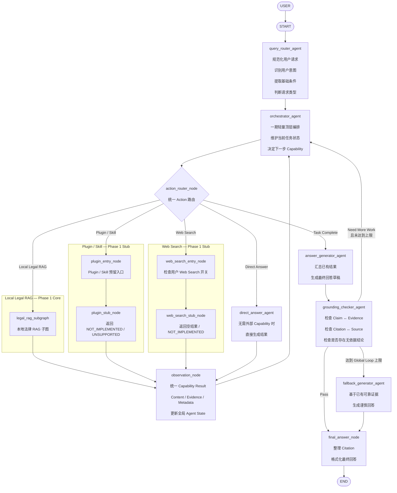
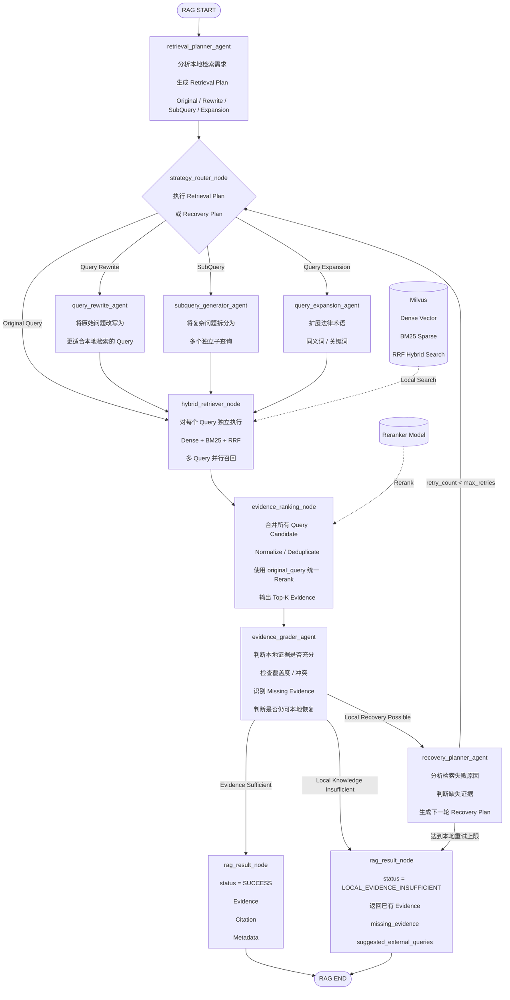

# LangGraph 法律助手一期技术设计
## Main Agent Graph + Local Legal RAG Subgraph

> 用途：作为后续 Codex 开发的直接实现依据。  
> 范围：**一期优先完成本地法律 RAG**；Web Search 与 Plugin / Skill **仅保留入口和 Stub**。  
> 目录约束：**本模块所有代码均放在 `agent/` 目录下**。  
> 架构原则：**主 Graph 负责顶层编排；Local Legal RAG 独立为 Subgraph；Web / Plugin 不进入 RAG 内部。**

---

# 1. 一期目标

本期目标是实现一个可运行、可测试、可恢复、可观测的法律 RAG Agent。

核心能力：

- 用户问题规范化与意图识别
- 顶层轻量 Agent Loop
- Local Legal RAG 独立 Subgraph
- Retrieval Plan
- Original Query
- Query Rewrite
- SubQuery
- Query Expansion
- Milvus Hybrid Search
  - Dense Vector
  - BM25 Sparse
  - RRF
- 多 Query 并行召回
- Candidate 聚合与去重
- 统一 Rerank
- Evidence Grading
- Local Recovery Loop
- Answer Generation
- Grounding Check
- Citation 整理
- Fallback
- Web Search Stub
- Plugin / Skill Stub

本期明确不实现：

- 真实 Web Search
- Web Research Subgraph
- Plugin Runtime
- Skill Runtime
- Plugin Registry
- Skill Registry
- MCP Runtime
- 外部插件安装
- Practice Profile
- Relax Filter

---

# 2. 核心架构原则

## 2.1 Node 命名规则

所有 LangGraph 节点统一遵循：

```text
带 LLM：
xxx_agent

不带 LLM：
xxx_node
```

例如：

```text
query_router_agent
retrieval_planner_agent
evidence_grader_agent

action_router_node
hybrid_retriever_node
evidence_ranking_node
```

---

## 2.2 主 Graph 与 RAG Subgraph 分离

主 Graph 负责：

```text
任务理解
顶层路由
Capability 调用
结果 Observation
最终回答
Grounding
```

Local RAG Subgraph 只负责：

```text
本地知识库检索
Query Rewrite
SubQuery
Query Expansion
Milvus Hybrid Search
RRF
Rerank
Evidence Grade
Local Recovery
```

RAG Subgraph：

```text
不调用 Web
不调用 Plugin
不调用 MCP
```

---

## 2.3 Web Search 与 Plugin 本期仅保留入口

主 Graph 保留：

```text
Web Search Capability
Plugin / Skill Capability
```

但本期内部只返回：

```text
NOT_IMPLEMENTED
```

这样后续二期替换内部实现即可，不需要修改主 Graph 的路由接口。

---

## 2.4 顶层 Loop 与 RAG Recovery Loop 分离

顶层 Loop：

```text
orchestrator_agent
    ↓
Capability
    ↓
observation_node
    ↓
orchestrator_agent
```

Local RAG Recovery Loop：

```text
retrieve
  ↓
grade
  ↓
recover
  ↓
retrieve
```

两者拥有独立的 retry / step budget。

---

# 3. 最终主 Graph

文件：

```text
agent/graph.py
```



---

# 4. 最终 Local Legal RAG Subgraph

文件：

```text
agent/subgraphs/legal_rag/graph.py
```



---

# 5. 推荐目录结构

```text
agent/
├── __init__.py
├── graph.py
├── state.py
├── config.py
├── schemas.py
├── constants.py
│
├── nodes/
│   ├── __init__.py
│   ├── query_router_agent.py
│   ├── orchestrator_agent.py
│   ├── action_router_node.py
│   ├── observation_node.py
│   ├── direct_answer_agent.py
│   ├── answer_generator_agent.py
│   ├── grounding_checker_agent.py
│   ├── fallback_generator_agent.py
│   └── final_answer_node.py
│
├── subgraphs/
│   ├── __init__.py
│   └── legal_rag/
│       ├── __init__.py
│       ├── graph.py
│       ├── state.py
│       ├── config.py
│       ├── schemas.py
│       │
│       ├── nodes/
│       │   ├── __init__.py
│       │   ├── retrieval_planner_agent.py
│       │   ├── strategy_router_node.py
│       │   ├── query_rewrite_agent.py
│       │   ├── subquery_generator_agent.py
│       │   ├── query_expansion_agent.py
│       │   ├── hybrid_retriever_node.py
│       │   ├── evidence_ranking_node.py
│       │   ├── evidence_grader_agent.py
│       │   ├── recovery_planner_agent.py
│       │   └── rag_result_node.py
│       │
│       └── prompts/
│           ├── retrieval_planner.py
│           ├── query_rewrite.py
│           ├── subquery_generator.py
│           ├── query_expansion.py
│           ├── evidence_grader.py
│           └── recovery_planner.py
│
├── web/
│   ├── __init__.py
│   ├── web_search_entry_node.py
│   └── web_search_stub_node.py
│
├── plugins/
│   ├── __init__.py
│   ├── plugin_entry_node.py
│   └── plugin_stub_node.py
│
├── prompts/
│   ├── query_router.py
│   ├── orchestrator.py
│   ├── direct_answer.py
│   ├── answer_generator.py
│   ├── grounding_checker.py
│   └── fallback_generator.py
│
├── services/
│   ├── __init__.py
│   ├── llm_service.py
│   ├── milvus_service.py
│   ├── embedding_service.py
│   ├── reranker_service.py
│   └── citation_service.py
│
├── utils/
│   ├── __init__.py
│   ├── query_utils.py
│   ├── evidence_utils.py
│   ├── dedup_utils.py
│   ├── trace_utils.py
│   └── timing_utils.py
│
└── tests/
    ├── __init__.py
    ├── test_main_graph.py
    ├── test_query_router.py
    ├── test_orchestrator.py
    ├── test_action_router.py
    ├── test_observation.py
    ├── test_web_stub.py
    ├── test_plugin_stub.py
    │
    └── legal_rag/
        ├── test_retrieval_planner.py
        ├── test_strategy_router.py
        ├── test_query_rewrite.py
        ├── test_subquery_generator.py
        ├── test_query_expansion.py
        ├── test_hybrid_retriever.py
        ├── test_evidence_ranking.py
        ├── test_evidence_grader.py
        ├── test_recovery_planner.py
        └── test_legal_rag_e2e.py
```

---

# 6. 主 Graph State

文件：

```text
agent/state.py
```

```python
from typing import TypedDict, Any, Optional

class AgentState(TypedDict, total=False):

    # -------------------------
    # Input
    # -------------------------
    original_query: str
    normalized_query: str

    # -------------------------
    # User Controls
    # -------------------------
    web_search_enabled: bool

    # -------------------------
    # Query Router
    # -------------------------
    intent: str
    request_type: str
    extracted_conditions: dict[str, Any]

    # -------------------------
    # Orchestrator
    # -------------------------
    current_action: str
    action_reason: str

    global_step_count: int
    max_global_steps: int

    # -------------------------
    # Capability Result
    # -------------------------
    last_capability: Optional[str]
    capability_status: Optional[str]
    capability_result: dict[str, Any]

    # -------------------------
    # Evidence
    # -------------------------
    evidence: list[dict[str, Any]]
    citations: list[dict[str, Any]]

    # -------------------------
    # Answer
    # -------------------------
    answer_draft: Optional[str]
    final_answer: Optional[str]

    # -------------------------
    # Grounding
    # -------------------------
    grounding_passed: bool
    grounding_issues: list[str]

    # -------------------------
    # Trace
    # -------------------------
    trace: list[dict[str, Any]]
```

---

# 7. Local RAG State

文件：

```text
agent/subgraphs/legal_rag/state.py
```

```python
from typing import TypedDict, Any, Optional

class EvidenceItem(TypedDict, total=False):
    id: str
    document_id: str
    chunk_id: str

    title: str
    content: str

    query: str
    query_type: str

    dense_score: float
    bm25_score: float
    rrf_score: float
    rerank_score: float

    source_name: str
    source_type: str

    metadata: dict[str, Any]


class LegalRAGState(TypedDict, total=False):

    # -------------------------
    # Input
    # -------------------------
    original_query: str
    normalized_query: str

    # -------------------------
    # Planning
    # -------------------------
    retrieval_plan: dict[str, Any]
    recovery_plan: dict[str, Any]
    current_plan: dict[str, Any]

    # -------------------------
    # Query Variants
    # -------------------------
    rewritten_queries: list[str]
    sub_queries: list[str]
    expanded_queries: list[str]

    retrieval_queries: list[dict[str, str]]

    # -------------------------
    # Retrieval
    # -------------------------
    retrieval_candidates: list[EvidenceItem]

    # -------------------------
    # Evidence
    # -------------------------
    ranked_evidence: list[EvidenceItem]

    evidence_sufficient: bool
    evidence_confidence: float

    missing_evidence: list[str]
    evidence_conflicts: list[str]

    local_recovery_possible: bool

    # -------------------------
    # Retry
    # -------------------------
    retry_count: int
    max_retries: int

    # -------------------------
    # Result
    # -------------------------
    rag_status: str
    suggested_external_queries: list[str]

    # -------------------------
    # Trace
    # -------------------------
    trace: list[dict[str, Any]]
```

---

# 8. 主 Graph Structured Output Schema

文件：

```text
agent/schemas.py
```

## 8.1 QueryRouterOutput

```python
from pydantic import BaseModel, Field
from typing import Literal

class QueryRouterOutput(BaseModel):

    normalized_query: str

    intent: Literal[
        "legal_question",
        "general_question",
        "plugin_request",
        "web_request",
        "other"
    ]

    request_type: Literal[
        "local_rag",
        "plugin",
        "web",
        "direct"
    ]

    extracted_conditions: dict = Field(default_factory=dict)
```

---

## 8.2 OrchestratorDecision

```python
class OrchestratorDecision(BaseModel):

    action: Literal[
        "local_rag",
        "plugin",
        "web_search",
        "direct_answer",
        "finish"
    ]

    reason: str
```

---

## 8.3 GroundingCheck

```python
class GroundingCheck(BaseModel):

    passed: bool

    unsupported_claims: list[str] = Field(
        default_factory=list
    )

    citation_issues: list[str] = Field(
        default_factory=list
    )

    reason: str = ""
```

---

# 9. RAG Structured Output Schema

文件：

```text
agent/subgraphs/legal_rag/schemas.py
```

## 9.1 RetrievalPlan

```python
class RetrievalPlan(BaseModel):

    use_original_query: bool = True
    use_query_rewrite: bool = False
    use_subquery: bool = False
    use_query_expansion: bool = False

    target_evidence: list[str] = Field(
        default_factory=list
    )

    reason: str = ""
```

注意：

```text
RetrievalPlan 是多选，不是单选。
```

允许：

```json
{
  "use_original_query": true,
  "use_query_rewrite": true,
  "use_subquery": true,
  "use_query_expansion": false
}
```

---

## 9.2 EvidenceGrade

```python
class EvidenceGrade(BaseModel):

    sufficient: bool

    confidence: float

    local_recovery_possible: bool

    missing_evidence: list[str] = Field(
        default_factory=list
    )

    conflicts: list[str] = Field(
        default_factory=list
    )

    suggested_external_queries: list[str] = Field(
        default_factory=list
    )

    reason: str = ""
```

---

## 9.3 RecoveryPlan

```python
class RecoveryPlan(BaseModel):

    actions: list[
        Literal[
            "query_rewrite",
            "subquery",
            "query_expansion"
        ]
    ]

    reason: str

    missing_evidence: list[str] = Field(
        default_factory=list
    )
```

---

# 10. Capability Result 统一结构

主 Graph 所有 Capability 最终必须统一为同一种结果结构。

建议：

```python
class CapabilityResult(BaseModel):

    capability: str

    status: str

    content: str | None = None

    evidence: list[dict] = []

    citations: list[dict] = []

    metadata: dict = {}
```

例如 Local RAG：

```json
{
  "capability": "local_legal_rag",
  "status": "SUCCESS",
  "content": null,
  "evidence": [],
  "citations": [],
  "metadata": {}
}
```

Evidence 不足：

```json
{
  "capability": "local_legal_rag",
  "status": "LOCAL_EVIDENCE_INSUFFICIENT",
  "content": null,
  "evidence": [],
  "metadata": {
    "missing_evidence": [],
    "suggested_external_queries": []
  }
}
```

Web Stub：

```json
{
  "capability": "web_search",
  "status": "NOT_IMPLEMENTED"
}
```

Plugin Stub：

```json
{
  "capability": "plugin",
  "status": "NOT_IMPLEMENTED"
}
```

---

# 11. 主 Graph 节点设计

## 11.1 `query_router_agent`

文件：

```text
agent/nodes/query_router_agent.py
```

类型：

```text
LLM Agent
```

职责：

- Query normalize
- Intent classify
- 请求类型判断
- 基础条件提取

不负责：

- 复杂 Retrieval Plan
- SubQuery
- RAG 策略生成

输出：

```text
normalized_query
intent
request_type
extracted_conditions
```

---

# 12. `orchestrator_agent`

文件：

```text
agent/nodes/orchestrator_agent.py
```

类型：

```text
LLM Agent
```

一期职责应保持轻量：

```text
根据 Query Router 结果
+
当前 Capability Result
+
当前 Global State

决定：

local_rag
plugin
web_search
direct_answer
finish
```

一期不做：

```text
复杂 Skill 编排
多 Agent delegation
动态 Plugin discovery
MCP tool planning
```

必须受：

```text
max_global_steps
```

控制。

建议：

```text
max_global_steps = 4
```

---

# 13. `action_router_node`

类型：

```text
Deterministic Node
```

只根据：

```python
state["current_action"]
```

进行 Conditional Edge。

不调用 LLM。

---

# 14. `observation_node`

统一 Capability Result。

职责：

```text
1. 保存 last_capability
2. 保存 capability_status
3. 合并 evidence
4. 合并 citation
5. 更新 trace
6. global_step_count += 1
```

不要生成自然语言。

---

# 15. Web Stub

## 15.1 `web_search_entry_node`

职责：

检查：

```python
state["web_search_enabled"]
```

如果：

```text
false
```

返回：

```text
DISABLED
```

如果：

```text
true
```

继续进入 Stub。

---

## 15.2 `web_search_stub_node`

当前实现：

```python
async def web_search_stub_node(state):
    return {
        "capability_result": {
            "capability": "web_search",
            "status": "NOT_IMPLEMENTED",
            "evidence": [],
            "citations": [],
        }
    }
```

禁止实际访问 Web。

---

# 16. Plugin Stub

## `plugin_entry_node`

负责保留未来稳定接口。

一期不解析插件。

## `plugin_stub_node`

返回：

```text
NOT_IMPLEMENTED
```

不得动态：

```text
import
exec
git clone
加载外部代码
```

---

# 17. `direct_answer_agent`

适用于：

```text
无需 Local RAG
无需 Web
无需 Plugin
```

例如：

```text
普通聊天
简单概念解释
系统功能说明
```

法律事实型问题默认优先：

```text
Local RAG
```

---

# 18. `answer_generator_agent`

输入：

```text
original_query
evidence
citations
capability_result
```

职责：

将能力执行结果转为最终回答草稿。

要求：

```text
不得编造 Evidence
不得编造 Citation
不得编造法条编号
不得编造案例编号
```

---

# 19. `grounding_checker_agent`

检查：

```text
Claim ↔ Evidence
Citation ↔ Source
结论 ↔ Retrieved Context
```

如果失败：

```text
仍有 Global Step Budget
    → 回 Orchestrator

达到上限
    → fallback
```

---

# 20. `final_answer_node`

类型：

```text
Deterministic Node
```

负责：

```text
Markdown 格式
Citation 编号
Citation 去重
输出结构
```

不再做推理。

---

# 21. Local RAG：`retrieval_planner_agent`

职责：

根据：

```text
original_query
normalized_query
```

生成：

```text
Retrieval Plan
```

可同时选择多个：

```text
Original
Rewrite
SubQuery
Expansion
```

不是四选一。

---

# 22. `strategy_router_node`

类型：

```text
Deterministic Node
```

统一处理：

```text
首次 Retrieval Plan
Recovery Plan
```

推荐 state：

```python
current_plan
```

首次：

```python
current_plan = retrieval_plan
```

Recovery：

```python
current_plan = recovery_plan
```

---

# 23. Query Rewrite

文件：

```text
query_rewrite_agent.py
```

建议：

```text
MAX_REWRITTEN_QUERIES = 2
```

输出：

```python
rewritten_queries: list[str]
```

---

# 24. SubQuery

文件：

```text
subquery_generator_agent.py
```

默认：

```text
MAX_SUBQUERIES = 5
```

要求：

```text
每个 SubQuery：
独立
可检索
尽量不重叠
服务于原始问题
```

示例：

```text
原问题：
违法解除劳动合同，工作7年，月薪3万，能赔多少？

SubQuery：

1. 违法解除劳动合同的法律依据
2. 违法解除赔偿金计算规则
3. 工作7年对应赔偿月数
4. 高工资是否受到工资上限规则影响
```

---

# 25. Query Expansion

用途：

```text
补充法律专业术语
同义词
裁判文书常见表述
```

例如：

```text
辞退
```

扩展：

```text
解除劳动合同
违法解除
解除劳动关系
赔偿金
经济补偿
```

建议：

```text
MAX_EXPANDED_QUERIES = 3
```

---

# 26. Retrieval Query 汇总

所有 Query Variant 最终合并为：

```python
[
    {
        "query": "...",
        "query_type": "original"
    },
    {
        "query": "...",
        "query_type": "rewrite"
    },
    {
        "query": "...",
        "query_type": "subquery"
    },
    {
        "query": "...",
        "query_type": "expansion"
    }
]
```

去重：

```text
normalized query string
```

限制：

```text
MAX_RETRIEVAL_QUERIES = 8
```

---

# 27. `hybrid_retriever_node`

这是一期 RAG 的核心 Node。

内部完成：

```text
Dense
+
BM25
+
RRF
```

不再拆成三个 LangGraph Node。

原因：

```text
三者属于同一个 Retrieval Stage
且 Milvus 可统一 Hybrid Search
```

---

# 28. SubQuery 与 Hybrid Search 的结合

必须是：

```text
SubQuery 1
    ↓
Dense + BM25 + RRF

SubQuery 2
    ↓
Dense + BM25 + RRF

SubQuery 3
    ↓
Dense + BM25 + RRF
```

不是：

```text
SubQuery1 → BM25
SubQuery2 → Dense
```

所有 Query 默认走完整 Hybrid Retrieval。

实际 Graph 中只有一个：

```text
hybrid_retriever_node
```

它内部并发执行多个 Query。

---

# 29. Milvus Service

文件：

```text
agent/services/milvus_service.py
```

推荐接口：

```python
class MilvusService:

    async def hybrid_search(
        self,
        query: str,
        *,
        dense_top_k: int,
        bm25_top_k: int,
        hybrid_top_k: int,
        rrf_k: int,
    ) -> list[EvidenceItem]:
        ...
```

优先使用 Milvus 原生：

```text
Dense + Sparse + RRFRanker
```

---

# 30. 多 Query 并发

`hybrid_retriever_node` 必须支持：

```python
await asyncio.gather(...)
```

概念：

```python
results = await asyncio.gather(
    *[
        milvus_service.hybrid_search(q["query"])
        for q in state["retrieval_queries"]
    ]
)
```

避免串行：

```text
Q1
等
Q2
等
Q3
```

---

# 31. Hybrid Retrieval 参数

建议一期默认：

```python
dense_top_k = 30
bm25_top_k = 30
hybrid_top_k = 20

rrf_k = 60
```

后续根据评测集调优。

---

# 32. `evidence_ranking_node`

这个节点是：

```text
原 evidence_aggregator_node
+
reranker_node
```

合并后的 Node。

职责：

```text
flatten
normalize
deduplicate
merge metadata
rerank
top-k
```

统一 Rerank Query：

```text
original_query
```

不要使用某个单独 SubQuery 作为最终 Rerank Query。

原因：

```text
SubQuery 用于 Recall
Original Query 用于最终 Relevance
```

---

# 33. Evidence 去重

优先级：

```text
chunk_id
>
document_id + chunk_index
>
content_hash
```

如果同一 Chunk 被多个 Query 命中：

```python
matched_queries = [...]
```

合并到同一 EvidenceItem。

---

# 34. Reranker Service

文件：

```text
agent/services/reranker_service.py
```

接口：

```python
class RerankerService:

    async def rerank(
        self,
        query: str,
        documents: list[EvidenceItem],
        top_n: int,
    ) -> list[EvidenceItem]:
        ...
```

一期建议：

```text
rerank_top_k = 10
```

---

# 35. `evidence_grader_agent`

必须独立。

不要与：

```text
evidence_ranking_node
```

合并。

两者职责不同：

```text
Ranking：
哪些证据更相关？

Grading：
这些证据够不够回答？
```

检查：

```text
Coverage
Missing Evidence
Conflicts
Local Recovery Possibility
```

---

# 36. `recovery_planner_agent`

触发：

```text
Evidence Insufficient
+
Local Recovery Possible
```

可用动作只有：

```text
query_rewrite
subquery
query_expansion
```

没有：

```text
web_search
plugin
relax_filter
```

输入：

```text
original query
已有 retrieval queries
ranked evidence
missing evidence
retry count
历史 strategy
```

必须避免重复执行同样失败策略。

---

# 37. Local Recovery Loop

```text
evidence_grader_agent
        ↓
insufficient
        ↓
recovery_planner_agent
        ↓
strategy_router_node
        ↓
rewrite / subquery / expansion
        ↓
hybrid_retriever_node
        ↓
evidence_ranking_node
        ↓
evidence_grader_agent
```

默认：

```text
max_retries = 2
```

一期不建议超过：

```text
3
```

---

# 38. RAG Result

成功：

```python
{
    "rag_status": "SUCCESS",
    "ranked_evidence": [...],
}
```

证据不足：

```python
{
    "rag_status": "LOCAL_EVIDENCE_INSUFFICIENT",
    "ranked_evidence": [...],
    "missing_evidence": [...],
    "suggested_external_queries": [...]
}
```

`suggested_external_queries` 只是未来扩展信息。

Local RAG 不关心后续是否真的使用。

---

# 39. LLM Service

文件：

```text
agent/services/llm_service.py
```

统一封装：

```text
ChatOpenAI
ChatOllama
其他 OpenAI-compatible model
```

节点不得直接散落具体 SDK 初始化。

推荐：

```python
class LLMService:

    async def invoke(...):
        ...

    async def structured_invoke(
        self,
        prompt,
        schema,
        **kwargs,
    ):
        ...
```

所有 Planner / Grader 类节点优先：

```text
Structured Output
```

---

# 40. Prompt 管理

禁止：

```python
prompt = """..."""
```

大量散落 Node 文件。

统一：

```text
agent/prompts/
agent/subgraphs/legal_rag/prompts/
```

Node 只 import Prompt。

---

# 41. Citation 数据结构

建议：

```python
class Citation(BaseModel):

    citation_id: str

    document_id: str
    chunk_id: str

    title: str

    source_name: str | None = None
    source_url: str | None = None

    article_number: str | None = None

    metadata: dict = {}
```

---

# 42. 法律 Evidence Metadata

Milvus 每个 Chunk 建议至少保留：

```text
chunk_id
document_id

title
content

document_type

jurisdiction
law_name
law_version

article_number

effective_date
expiry_date

source_name
source_url

created_at
updated_at
```

案例建议额外：

```text
case_number
court
judgment_date
case_type
```

---

# 43. Config

主配置：

```text
agent/config.py
```

建议：

```python
class AgentConfig(BaseSettings):

    max_global_steps: int = 4

    web_search_enabled_default: bool = False

    plugin_enabled: bool = False
```

RAG 配置：

```text
agent/subgraphs/legal_rag/config.py
```

```python
class LegalRAGConfig(BaseSettings):

    max_retries: int = 2

    max_subqueries: int = 5
    max_rewritten_queries: int = 2
    max_expanded_queries: int = 3

    max_retrieval_queries: int = 8

    dense_top_k: int = 30
    bm25_top_k: int = 30
    hybrid_top_k: int = 20

    rerank_top_k: int = 10

    rrf_k: int = 60

    evidence_confidence_threshold: float = 0.80
```

---

# 44. 主 Graph 构建骨架

```python
from langgraph.graph import StateGraph, START, END

def build_agent_graph():

    graph = StateGraph(AgentState)

    graph.add_node(
        "query_router_agent",
        query_router_agent,
    )

    graph.add_node(
        "orchestrator_agent",
        orchestrator_agent,
    )

    graph.add_node(
        "action_router_node",
        action_router_node,
    )

    graph.add_node(
        "legal_rag_subgraph",
        build_legal_rag_graph(),
    )

    graph.add_node(
        "plugin_entry_node",
        plugin_entry_node,
    )

    graph.add_node(
        "plugin_stub_node",
        plugin_stub_node,
    )

    graph.add_node(
        "web_search_entry_node",
        web_search_entry_node,
    )

    graph.add_node(
        "web_search_stub_node",
        web_search_stub_node,
    )

    graph.add_node(
        "observation_node",
        observation_node,
    )

    graph.add_node(
        "direct_answer_agent",
        direct_answer_agent,
    )

    graph.add_node(
        "answer_generator_agent",
        answer_generator_agent,
    )

    graph.add_node(
        "grounding_checker_agent",
        grounding_checker_agent,
    )

    graph.add_node(
        "fallback_generator_agent",
        fallback_generator_agent,
    )

    graph.add_node(
        "final_answer_node",
        final_answer_node,
    )

    graph.add_edge(
        START,
        "query_router_agent",
    )

    # 其余通过 conditional edges 构建

    return graph.compile()
```

---

# 45. Legal RAG Graph 构建骨架

```python
def build_legal_rag_graph():

    graph = StateGraph(LegalRAGState)

    graph.add_node(
        "retrieval_planner_agent",
        retrieval_planner_agent,
    )

    graph.add_node(
        "strategy_router_node",
        strategy_router_node,
    )

    graph.add_node(
        "query_rewrite_agent",
        query_rewrite_agent,
    )

    graph.add_node(
        "subquery_generator_agent",
        subquery_generator_agent,
    )

    graph.add_node(
        "query_expansion_agent",
        query_expansion_agent,
    )

    graph.add_node(
        "hybrid_retriever_node",
        hybrid_retriever_node,
    )

    graph.add_node(
        "evidence_ranking_node",
        evidence_ranking_node,
    )

    graph.add_node(
        "evidence_grader_agent",
        evidence_grader_agent,
    )

    graph.add_node(
        "recovery_planner_agent",
        recovery_planner_agent,
    )

    graph.add_node(
        "rag_result_node",
        rag_result_node,
    )

    return graph.compile()
```

---

# 46. Routing Functions

## 46.1 Main Action Router

```python
def route_action(state):

    action = state["current_action"]

    mapping = {
        "local_rag": "legal_rag_subgraph",
        "plugin": "plugin_entry_node",
        "web_search": "web_search_entry_node",
        "direct_answer": "direct_answer_agent",
        "finish": "answer_generator_agent",
    }

    return mapping[action]
```

---

## 46.2 Evidence Grader Router

```python
def route_after_evidence_grade(state):

    if state["evidence_sufficient"]:
        return "rag_result_node"

    if (
        state["local_recovery_possible"]
        and state["retry_count"] < state["max_retries"]
    ):
        return "recovery_planner_agent"

    return "rag_result_node"
```

`rag_result_node` 根据 State 决定：

```text
SUCCESS
或
LOCAL_EVIDENCE_INSUFFICIENT
```

---

# 47. 错误处理

## Milvus 错误

允许：

```text
node 内部重试 1 次
```

仍失败：

```text
返回 RETRIEVAL_ERROR
```

不要无限 loop。

---

## Reranker 错误

可以降级：

```text
直接使用 RRF 排序结果
```

并记录：

```text
reranker_degraded = true
```

---

## LLM Structured Output 错误

允许：

```text
重试 1 次
```

仍失败：

```text
返回安全默认状态
```

Planner 默认：

```text
Original Query
```

Grader 默认：

```text
insufficient
```

避免误判证据充分。

---

# 48. Trace / Logging

每个 Node 统一写 Trace：

```python
{
    "node": "hybrid_retriever_node",
    "duration_ms": 123,
    "status": "success",
    "input_count": 4,
    "output_count": 53,
}
```

LLM 节点增加：

```text
model
latency
prompt_tokens
completion_tokens
```

RAG 额外：

```text
query_count
candidate_count
dedup_count
rerank_count
retry_count
```

---

# 49. 性能约束

一期默认：

```text
max retrieval queries = 8
hybrid top-k / query = 20
max raw candidates ≈ 160
rerank top-k = 10
```

不要把所有候选直接发送给最终 Answer LLM。

---

# 50. 测试策略

## Unit Test

必须覆盖：

```text
query_router_agent
orchestrator_agent
action_router_node
web stub
plugin stub

retrieval_planner_agent
strategy_router_node
query_rewrite_agent
subquery_generator_agent
query_expansion_agent
hybrid_retriever_node
evidence_ranking_node
evidence_grader_agent
recovery_planner_agent
```

---

## RAG Integration Test

覆盖：

```text
Simple Query
Complex Query
SubQuery
Rewrite
Expansion
Recovery
Evidence Insufficient
```

---

## Main Graph E2E

至少：

### Case 1

```text
简单法律事实问题
→ Local RAG
→ SUCCESS
→ Answer
```

### Case 2

```text
复杂法律问题
→ SubQuery
→ Hybrid Search
→ Recovery
→ SUCCESS
```

### Case 3

```text
本地无相关证据
→ LOCAL_EVIDENCE_INSUFFICIENT
→ 谨慎回答
```

### Case 4

```text
Web Search enabled
→ Web Entry
→ NOT_IMPLEMENTED
```

### Case 5

```text
Plugin Request
→ Plugin Entry
→ NOT_IMPLEMENTED
```

---

# 51. Mock 要求

测试中必须允许替换：

```text
LLMService
MilvusService
RerankerService
```

不要让单元测试依赖真实：

```text
Milvus
Ollama
外部 API
```

---

# 52. Codex 实现顺序

建议严格按顺序开发。

## Phase A：基础类型

```text
agent/state.py
agent/config.py
agent/schemas.py

legal_rag/state.py
legal_rag/config.py
legal_rag/schemas.py
```

---

## Phase B：Services

```text
llm_service.py
milvus_service.py
embedding_service.py
reranker_service.py
citation_service.py
```

---

## Phase C：Local RAG Core

```text
retrieval_planner_agent
strategy_router_node
query_rewrite_agent
subquery_generator_agent
query_expansion_agent
hybrid_retriever_node
evidence_ranking_node
evidence_grader_agent
recovery_planner_agent
rag_result_node
```

---

## Phase D：RAG Graph

```text
agent/subgraphs/legal_rag/graph.py
```

先跑通 Local RAG 独立测试。

---

## Phase E：Main Nodes

```text
query_router_agent
orchestrator_agent
action_router_node
observation_node
direct_answer_agent
answer_generator_agent
grounding_checker_agent
fallback_generator_agent
final_answer_node
```

---

## Phase F：Stub

```text
web_search_entry_node
web_search_stub_node

plugin_entry_node
plugin_stub_node
```

---

## Phase G：Main Graph

```text
agent/graph.py
```

---

## Phase H：Tests

```text
unit
integration
e2e
```

---

# 53. Codex 强制实现约束

Codex 开发时必须遵循以下规则：

1. 所有模块都必须位于 `agent/` 目录。
2. 带 LLM 的 LangGraph Node 必须使用 `_agent` 后缀。
3. 确定性 Node 必须使用 `_node` 后缀。
4. Main Graph 与 Local RAG 必须分别构建。
5. Local RAG 必须作为独立 Subgraph 接入 Main Graph。
6. Local RAG 不得调用 Web Search。
7. Local RAG 不得调用 Plugin。
8. Web Search 本期只能 Stub。
9. Plugin / Skill 本期只能 Stub。
10. 不实现 Relax Filter。
11. Dense + BM25 + RRF 合并在 `hybrid_retriever_node`。
12. Evidence Aggregation + Reranker 合并在 `evidence_ranking_node`。
13. `evidence_grader_agent` 必须独立。
14. `strategy_router_node` 同时服务 Initial Retrieval 与 Recovery。
15. Retrieval Strategy 必须允许多选。
16. SubQuery 必须进入同一个 Hybrid Retrieval。
17. 多 Query 必须优先异步并发。
18. 最终 Rerank 必须使用 `original_query`。
19. RAG Recovery Loop 必须受 `max_retries` 控制。
20. Main Agent Loop 必须受 `max_global_steps` 控制。
21. LLM Planner / Grader 优先使用 Structured Output。
22. Prompt 与 Node 文件分离。
23. 外部依赖通过 `services/` 封装。
24. 不允许节点直接初始化多个重复 LLM Client。
25. 不允许业务节点直接访问底层 Milvus SDK。
26. 不允许将 Plugin / Web 实现偷偷加入一期。
27. 必须有 Unit / Integration / E2E Test。
28. 必须支持 Mock Service。
29. 必须统一记录 Node Trace。
30. 每个 Capability 必须返回统一 `CapabilityResult`。

---

# 54. 一期完成标准

一期完成时必须满足：

```text
User Query
   ↓
Main Graph
   ↓
Local Legal RAG Subgraph
   ↓
Milvus Dense + BM25 + RRF
   ↓
Rerank
   ↓
Evidence Grade
   ↓
必要时 Local Recovery
   ↓
RAG Result
   ↓
Answer Generation
   ↓
Grounding Check
   ↓
Final Answer
```

并且以下路径均可运行：

```text
Original Query
Rewrite
SubQuery
Query Expansion
Recovery
Evidence Insufficient
Fallback
Direct Answer
Web Stub
Plugin Stub
```

---

# 55. 二期扩展位置

后续实现 Web 时：

```text
Web Search Stub
    ↓
替换为
    ↓
web_research_subgraph
```

Main Graph 不需要重构。

后续实现 Plugin 时：

```text
Plugin Stub
    ↓
替换为
    ↓
plugin / skill runtime
```

Main Graph 不需要重构。

Local RAG 保持纯本地，不因二期增加 Web / Plugin 而修改职责边界。

---

# 56. 最终架构总结

一期最终结构：

```text
Main Agent Graph
│
├── Local Legal RAG
│       └── legal_rag_subgraph
│            ├── Retrieval Planner
│            ├── Strategy Router
│            ├── Rewrite
│            ├── SubQuery
│            ├── Expansion
│            ├── Milvus Hybrid Retrieval
│            ├── Evidence Ranking
│            ├── Evidence Grader
│            └── Local Recovery Loop
│
├── Web Search
│       └── Stub
│
├── Plugin / Skill
│       └── Stub
│
└── Direct Answer
```

设计核心：

> **一期先把 Local Legal RAG 做成独立、高质量、可恢复、可验证的 Subgraph。**

> **主 Graph 只承担轻量调度和最终回答。**

> **Web 与 Plugin 提前固定入口，但不提前引入复杂 Runtime。**

这保证了一期开发复杂度可控，同时为后续 Plugin / Web Research / MCP / Skill Runtime 保留稳定扩展边界。
